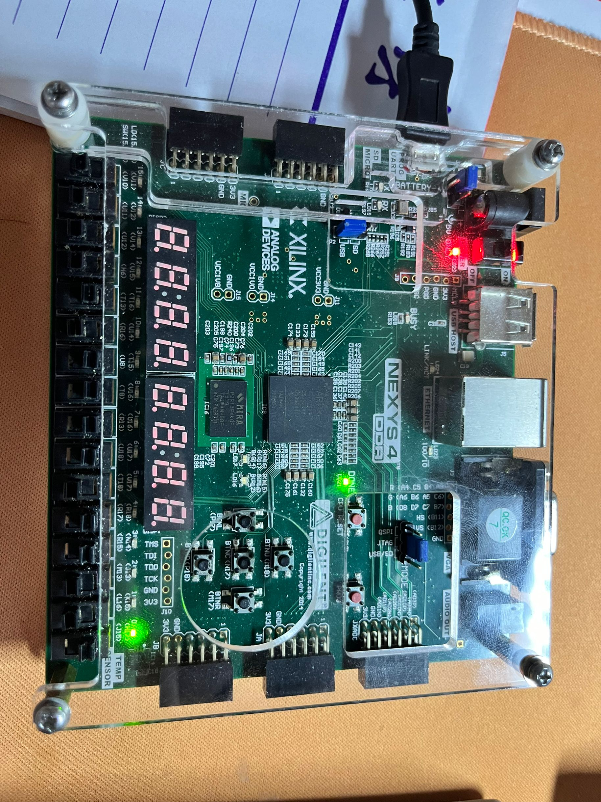
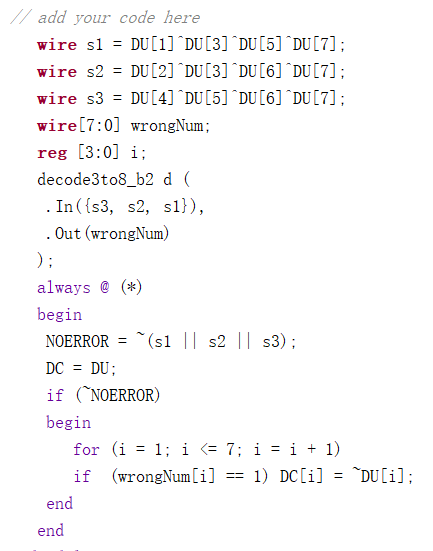
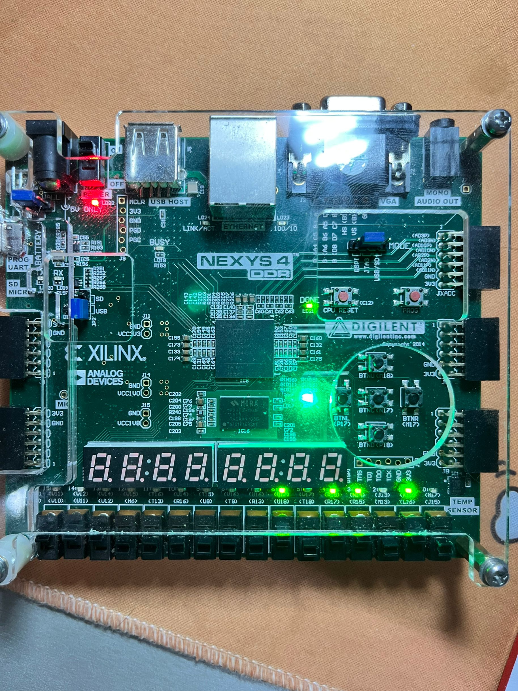

## 姓名：陈力峥  
## 学号：221240093

## 实验内容
### 实验一：4路3位数据传输实验
#### 整体方案设计：
整体设计通过多路选择器和多路分配器的组合来完成。同时加入一个控制端来控制多路选择器和分配器的输出。
#### 顶层模块设计：
1. 多路选择器模块
2. 多路分配器模块
#### 描述与定义：
输入端：
1. D0, D1, D2, D3 有三位，分别为多路选择器的四个输入。 S 为两位，作为控制端的输入。
#### 实验原理图：

#### 关键的设计语句/源代码
构成主体的 always 部分

#### 综合设计图

#### 实验数据仿真测试波形图

#### 开发板验证
下面的图分别对应控制端为 00 01 10 11 的情况
<div style="float:left;border:solid 1px 000;margin:2px;"></div>

<div style="float:left;border:solid 1px 000;margin:2px;"></div>

<div style="float:left;border:solid 1px 000;margin:2px;"></div>

<div style="float:left;border:solid 1px 000;margin:2px;"></div>


#### 错误现象及分析
最主要的错误为刚开始写 Verilog 时的语法错误，模块间缺少 begin & end，以及case语句后面不需要冒号等等。
### 实验二：七段数码管实验
#### 整体方案设计：
采用共阳极的数码管连接方式，需要完成能够输入一个十六进制数字并使其在指定的数码管上显示出正确的图像。具体实现即先输入一个四位二进制数字（对应开发板上的四个开关），然后将其转化为对应十六进制数字进行分支选择输出对应数字，最后通过控制端来控制输出到哪一个数码管。
#### 顶层模块设计：
1. 4to16译码器
2. 数码管模块
#### 描述与定义：
输出端：
1. O_seg 为七位，作为数码管的七段显示输出
2. O_led 为八位，控制输出到O_led为零的那一位数码管上。
输入端：
1. I 为四位，作为要显示数字的输入
2. S 为三位，三位译码选择指定数码管显示
#### 实验原理图：

#### 关键的设计语句/源代码

#### 综合设计图

#### 实验数据仿真测试波形图

#### 开发板验证
下面分别展示了数字九输出到不同位数码管上的情况，以及输出数字 F 、 5的情况
<div style="float:left;border:solid 1px 000;margin:2px;"></div>

<div style="float:left;border:solid 1px 000;margin:2px;"></div>
<div style="float:left;border:solid 1px 000;margin:2px;"></div>

<div style="float:left;border:solid 1px 000;margin:2px;"></div>
<div style="float:left;border:solid 1px 000;margin:2px;"></div>

<div style="float:left;border:solid 1px 000;margin:2px;"></div>
#### 错误现象及分析
在实验中，各个数码段与十六个数字的对应情况有所错误，最开始将Oa - Og 对应数码的真值直接作为输入，但实现后发现数字显示出来都是相反的，这是因为作为输入时应该按照从 Og - Oa 的顺序来输入才是正确的。

### 实验三：汉明码纠错实验
#### 整体方案设计：
需要根据汉明码的原理将待检测数据分为 i 组，其中每一组都需要对应一位的偶检验位。通过将检验位与该组其他的数字进行异或操作，可以分别得到s1, s2, s3.当只有三者全为零时才表示正确，否则至少有一位错误，当有一位错误时可以进行纠错。整体实现即为将三组异或结果输入3-8译码器中，若无错，则设置 NOERROR 为1，否则将译码器输出的那一位错误数据取反即可。
#### 顶层模块设计：
1. 四位异或模块
2. 3-8译码器
3. 汉明码纠错模块
#### 描述与定义：
输入端：输入七位的汉明码 DU
输出端：
1. 七位纠错后的结果 DC
2. 数据是否出错的一位标志 NOERROR
#### 实验原理图：

#### 关键的设计语句/源代码


#### 综合设计图

#### 实验数据仿真测试波形图


#### 开发板验证
<div style="float:left;border:solid 1px 000;margin:2px;"></div>

<div style="float:left;border:solid 1px 000;margin:2px;"></div>
<div style="float:left;border:solid 1px 000;margin:2px;"></div>

<div style="float:left;border:solid 1px 000;margin:2px;"></div>
<div style="float:left;border:solid 1px 000;margin:2px;"></div>

<div style="float:left;border:solid 1px 000;margin:2px;"></div>

#### 错误现象及分析
在具体实现的时候仍然因为对 Verilog 语法不熟悉而导致的错误，同时也有一些逻辑上的错误，如错误地将 NOERROR的值在有错误的时候设置为了1，错误地理解了变量的含义。
### 思考题一：
只需要对八位比较器稍微修改即可，具体实现及资源占用情况如下：


### 思考题二：
只需要对3-8译码器稍微修改即可，具体实现及资源占用情况如下：


### 思考题三：
在上面的数码管实验中，共阳极的情况下，一次只能够点亮一个数码管，但是可以通过引入时钟信号（高频），使得在每一个时钟信号都转变去点亮下一个数码管，如此不断循环，达到让八个数码管“同时”亮起来的效果，若需要实现一秒一次的滚动效果，则需要从高频的时钟信号中利用计数器分频出一个低频的时钟信号，每当这个低频的时钟信号转变时，就类比移位寄存器的效果，将所有数码管的数字都左移到下一个数码管上，由此就可以达到让学号滚动的效果。
### 思考题四
由于数据位此时有八位，那么三位检验位已经不足够了，此时需要四个检验位，也就是需要划分为四组，8 + 4 <= 15。此时只需要对原来七位汉明码修改即可。
```Verilog
`timescale 1ns / 1ps

module decode4to16_b2 ( //端口声明
 output reg [15:0] Out,
 input [4:1] In
); 
 reg [4 : 0] i;
  always @ (In) begin
    Out = 15'b000000000000000;

    for (i=0; i<=15; i=i+1) begin
       if(i == In) Out[i] = 1; 
    end
  end
endmodule 

module hamming7check(
   output reg [12:1] DC,    //纠错输出12位正确的结果
   output reg  NOERROR,    //校验结果正确标志位
   input  [12:1] DU         //输入7位汉明码
);
// add your code here
   wire s1 = DU[1]^DU[3]^DU[5]^DU[7]^DU[9]^DU[11]; // 四组检验组
   wire s2 = DU[2]^DU[3]^DU[6]^DU[7]^DU[10]^DU[11];
   wire s3 = DU[4]^DU[5]^DU[6]^DU[7]^DU[12];
   wire s4 = DU[8]^DU[9]^DU[10]^DU[11]^DU[12];
   wire[16:1] wrongNum;
   reg [4:0] i;
   decode4to16_b2 d (
    .In({s4, s3, s2, s1}),
    .Out(wrongNum)
   );
   always @ (*)
   begin
    NOERROR = ~(s1 || s2 || s3 || s4);
    DC = DU;
    if (~NOERROR)
    begin 
       for (i = 1; i <= 16; i = i + 1) 
       if  (wrongNum[i] == 1) DC[i] = ~DU[i];
    end
   end
endmodule
```

对于汉明码的检验文件也是同理，只需要改变其数据的位数，并且由于有八位数据位，只需要用 for 循环从0 - 255 进行遍历并对数据赋值即可。


