### 姓名：陈力峥  
### 学号：221240093

### 实验一：存储器读写实验
#### 整体方案设计：
需要实现一个总容量为 256 KB 的存储器，由 4 片 8 位的 64 KB 的 RAM 构成。每一片 RAM 对应某十六位地址中的特定字节（共四字节，一片 64 KB 的 RAM 存储对应的一个字节），同时需要根据 MemOp 来控制存取和写入的字节数和拓展方式，具体如下图
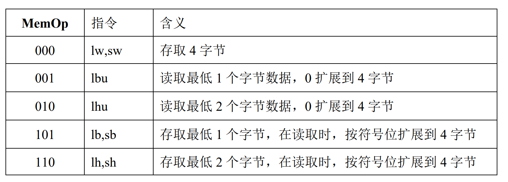
同时若需要运用在单周期的 CPU 上面需要改为在时钟的上升沿读取，写操作在时钟的下降沿运行即可。
#### 顶层模块设计：
首先是 Mem32b 模块，编写上面所描述的存储器，其次是 Mem32b_top 模块，是为了能够在开发板上进行验证，控制了输入输出和地址的位数。
#### 描述与定义：
Mem32b
```verilog
module mem32b(
 output reg [31:0] dataout, //输出数据
 input clk, //时钟信号
 input we, //存储器写使能信号，高电平时允许写入数据
 input [2:0] MemOp, //读写字节数控制信号
 input [31:0] datain, //输入数据
 input [15:0] addr //16 位存储器地址
);
```

Mem32b_top
```verilog
module mem32b_top(
    output [6:0]SEG,  //控制七段数码管   
    output [7:0]AN,   //控制数码管亮的位置            
    output [15:0] dataout_L8b, //输出数据的低十六位   
    input CLK100MHZ, //系统时钟            
    input BTNC, //重置清零按钮                 
    input [2:0] MemOp, //读取存取方式的控制信号          
    input we, //写使能信号                   
    input [3:0] addr_L4b,  // 地址低四位         
    input [7:0] datain_L8b // 输入数据的低八位 可重复四次后写入         
 );
```
#### 关键的设计语句/源代码
主要的控制逻辑
```verilog
always @(*)
begin
 if (~we) begin 
 case ({MemOp,addr[1:0]})
 5'b01000: begin dataout = outtmp; end
 
 5'b10000: begin dataout = {24'h000000, outtmp[7:0]}; end
 5'b10001: begin dataout = {24'h000000, outtmp[15:8]}; end
 5'b10010: begin dataout = {24'h000000, outtmp[23:16]}; end
 5'b10011: begin dataout = {24'h000000, outtmp[31:24]}; end
 
 5'b10100: begin dataout = {16'h0000, outtmp[15:0]}; end
 5'b10110: begin dataout = {16'h0000, outtmp[31:16]}; end
 
 5'b00000: begin dataout = {{24{outtmp[7]}}, outtmp[7:0]}; end
 5'b00001: begin dataout = {{24{outtmp[15]}}, outtmp[15:8]}; end
 5'b00010: begin dataout = {{24{outtmp[23]}}, outtmp[23:16]}; end
 5'b00011: begin dataout = {{24{outtmp[31]}}, outtmp[31:24]}; end
 
 5'b00100: begin dataout = {{16{outtmp[15]}}, outtmp[15:0]}; end
 5'b00110: begin dataout = {{16{outtmp[31]}}, outtmp[31:16]}; end

 default:dataout = outtmp;
 endcase
 end
 else begin 
 case ({MemOp,addr[1:0]})
 5'b01000: begin intmp = datain; end
 
 5'b00000: begin intmp = {outtmp[31:8], datain[7:0]}; end
 5'b00001: begin intmp = {outtmp[31:16], datain[15:8],outtmp[7:0]}; end
 5'b00010: begin intmp = {outtmp[31:24], datain[23:16],outtmp[15:0]}; end
 5'b00011: begin intmp = {datain[31:24],outtmp[23:0]}; end
 
 5'b00100: begin intmp = {outtmp[31:16], datain[15:0]}; end
 5'b00110: begin intmp = {datain[15:0],outtmp[31:16]}; end
 default:intmp = datain;
 endcase
end
end
```
#### 实验数据仿真测试波形图
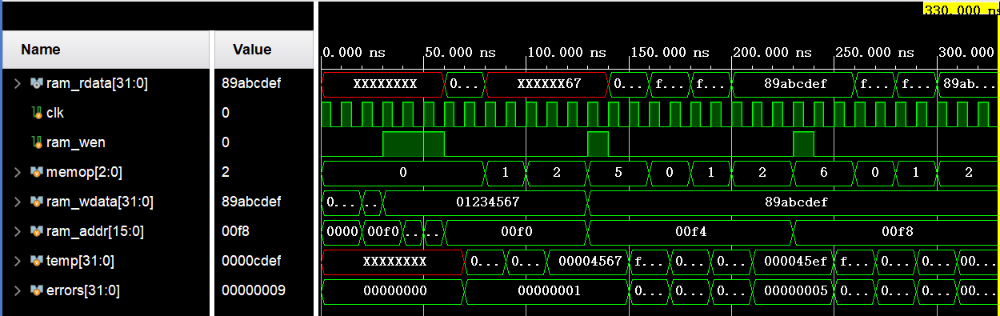

#### 开发板验证
下面以写入 83838383 的数据为例，展示按各个字节的方式以及不同拓展方式的显示结果
<div style="float:left;border:solid 1px 000;margin:2px;">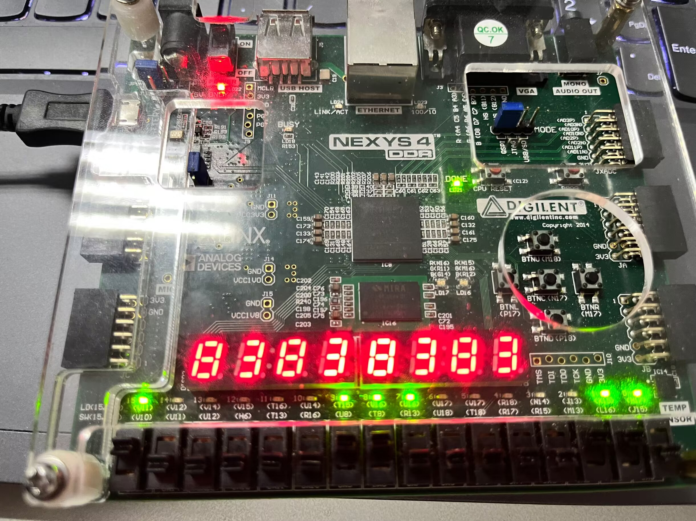</div>
<div style="float:left;border:solid 1px 000;margin:2px;">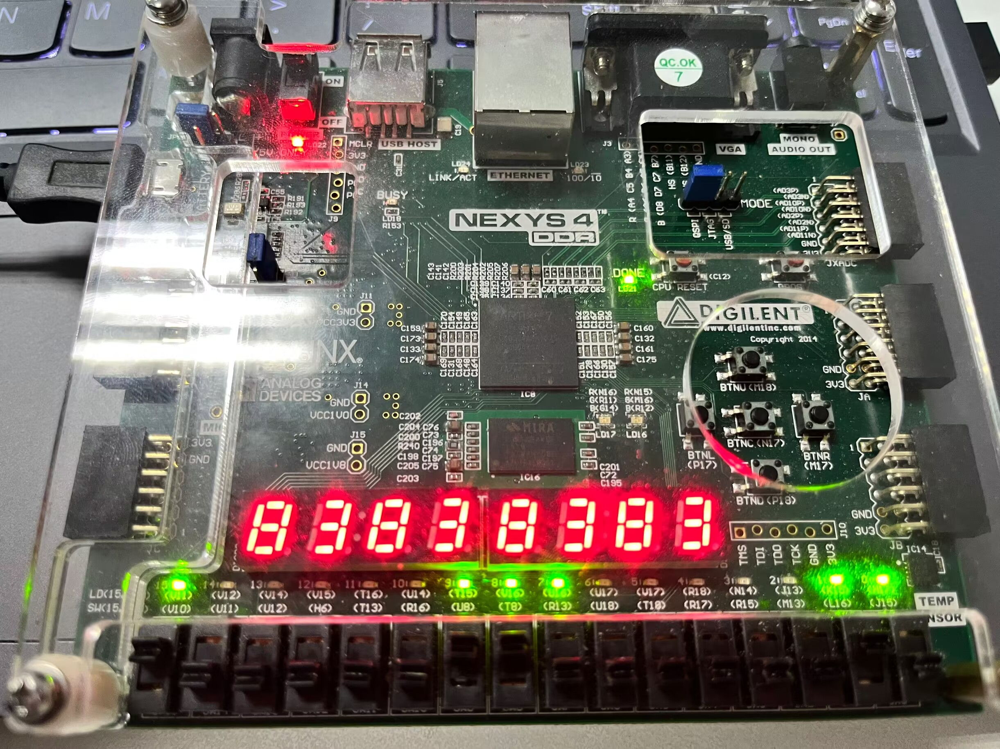</div>

<div style="float:left;border:solid 1px 000;margin:2px;">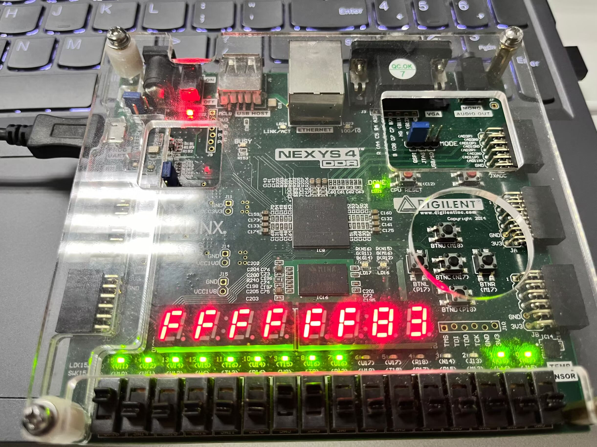</div>
<div style="float:left;border:solid 1px 000;margin:2px;">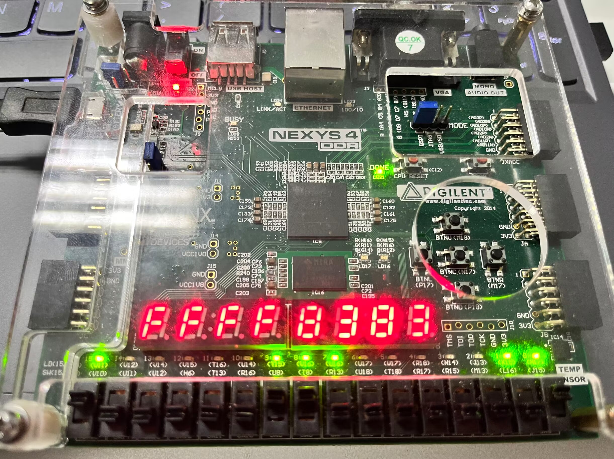</div>

<div style="float:left;border:solid 1px 000;margin:2px;">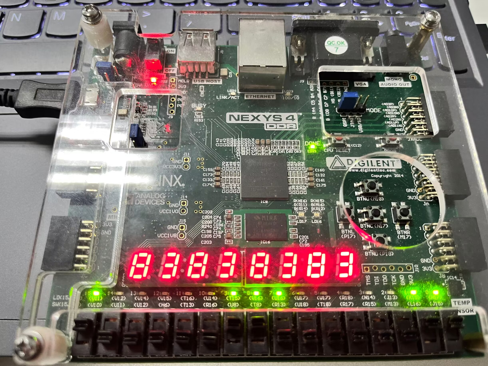</div>
<div style="float:left;border:solid 1px 000;margin:2px;">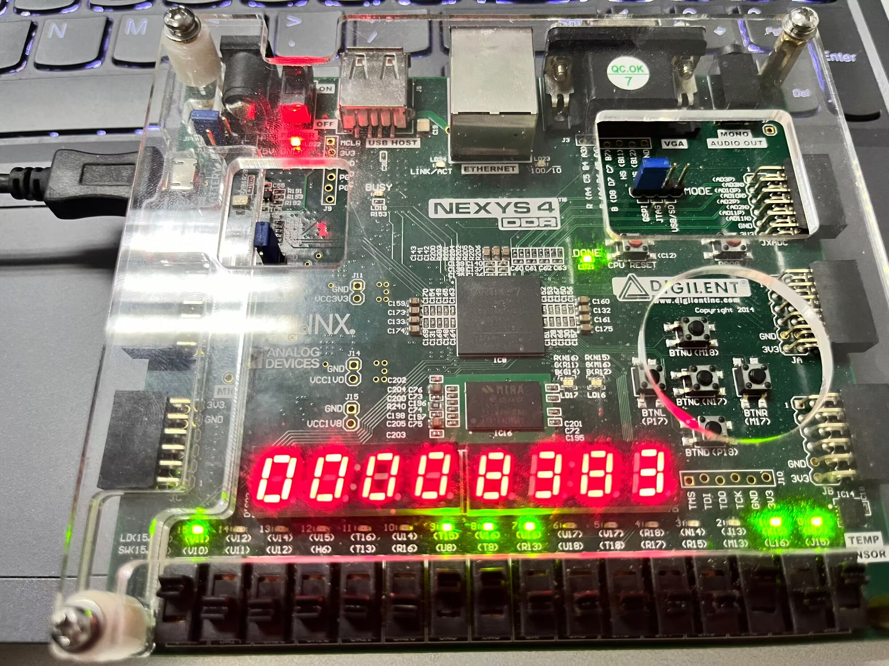</div>

<div style="float:left;border:solid 1px 000;margin:2px;">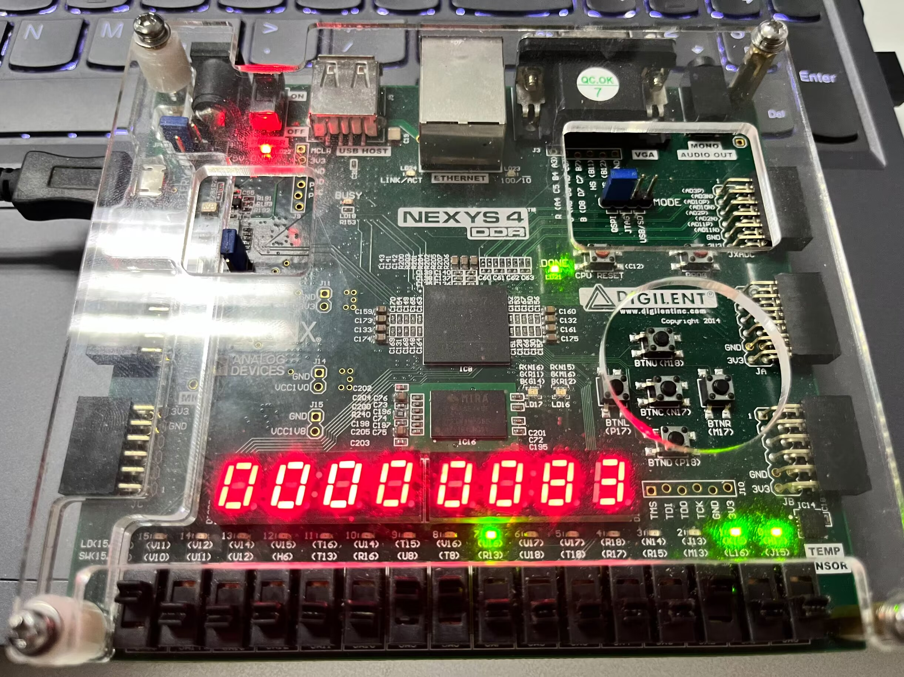</div>
<div style="float:left;border:solid 1px 000;margin:2px;">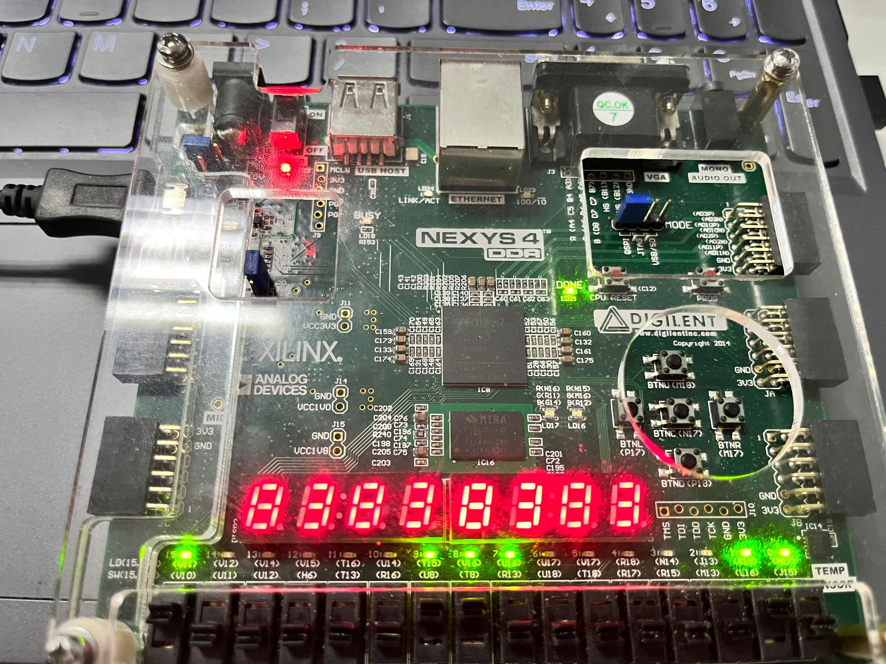</div>

### 思考题一：
分布式实现存储器：
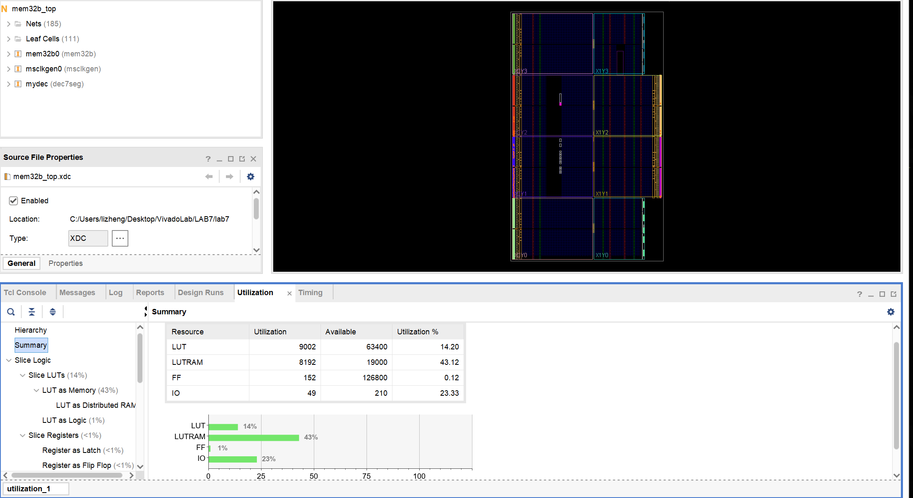
块存储器：
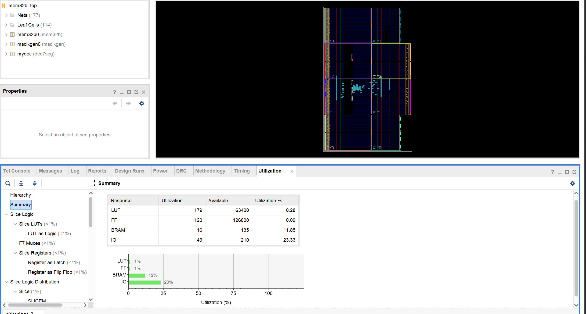
然后对块存储器分别使用同步（即原来的实现方式，只有在时钟边沿到来的时候读取）和异步（可以随时进行读取，可以看作组合逻辑）来进行仿真的结果如下：

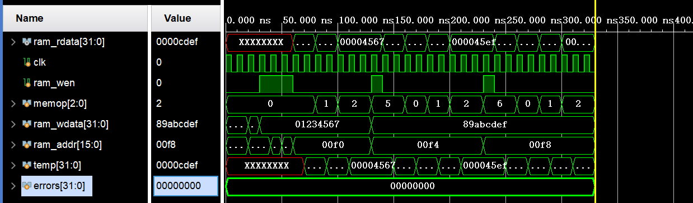
### 思考题二：
Cache 的大小越大，显然能够一次性存储在 Cache 里的数据就越多，那么命中率显然就会越高，在 Cache 较小的时候，增大容量命中率上升显著，随后对命中率提升的效果会越来越弱，大致呈现下面的趋势。
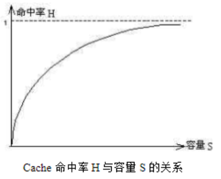
### 思考题三：
当指令 Cache 和数据 Cache 独立实现的时候，顶层 Cache 的有限状态机大致为：
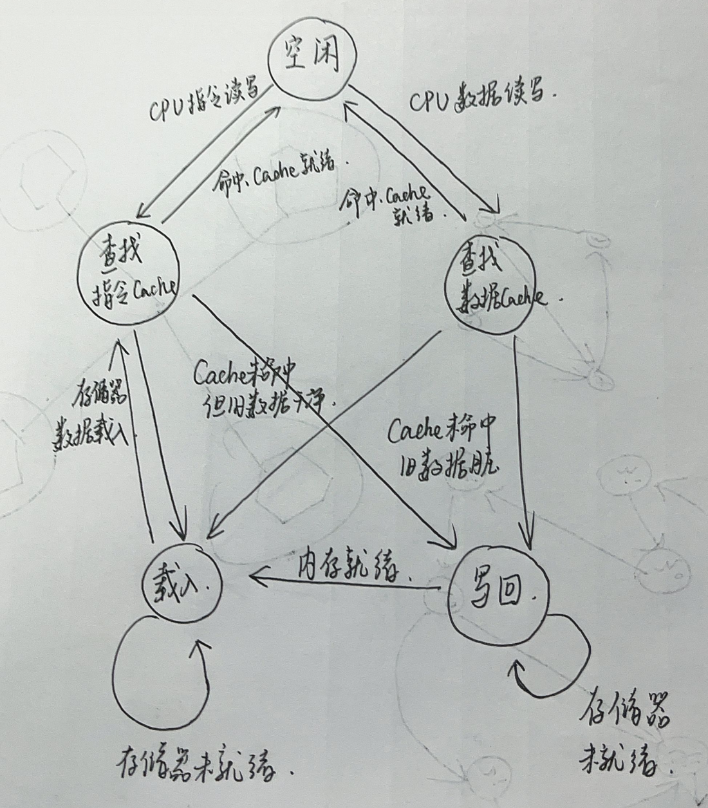


