## 姓名：陈力峥  
## 学号：221240093

## 实验内容
### 实验一：寄存器堆设计
#### 整体方案设计：
创建三十二个三十二位的 reg 型变量作为 GPR，需要完成读和写的功能，其中读的功能为组合逻辑，需要根据 ra32，rb32，来选择 busa32， busb32 的输出。写的功能为时序逻辑，需要在下一个时钟信号到达时，判断写使能信号 we 是否为 1，若为 1，则对 busw 对应的寄存器进行写入。因此这两个功能区分较为明显，在具体实现时采用两个 always 模块进行实现，一个根据 clk 时钟信号进行写，一个根据 ra，rb 信号的变化进行读的操作。但由于开发板的限制，需要再定义一个顶层的寄存器堆模块，来控制输入输出的具体情况。

#### 顶层模块设计：
1. 寄存器堆子模块
2. 寄存器堆顶层模块
#### 描述与定义：
1. 在寄存器堆子模块中
   输入信号：
   1. 时钟信号 clk，写使能信号 we
   2. 读取寄存器数据标号 ra，rb 均为五位
   3. 写入寄存器数据标号 rw，共五位
   输出信号：
   1. busa，busb均为 32位数据，输出所读到的数据
2. 在寄存器顶层模块中
   输入信号：
   1. 时钟信号 clk，写使能信号 we
   2. ra_hi 为 ra，rb，rw 共用的高两位，ra，rb，rw均为三位
   3. busw为四位的需要写入的数据，作为代表的输入（三十二位端口不够）
   输出信号：
   1. busa8, busb8 均为八位的输出，截取寄存器中的八位作为代表输出。 
#### 实验原理图：
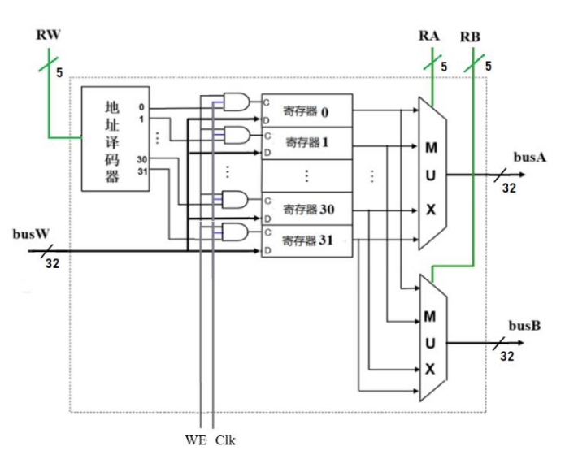
#### 关键的设计语句/源代码
分别为寄存器堆子模块和顶层模块的关键语句
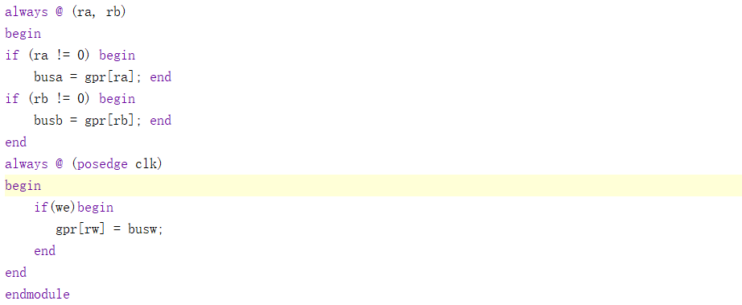
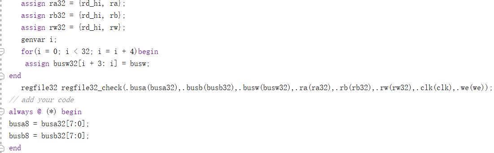
#### 综合设计图
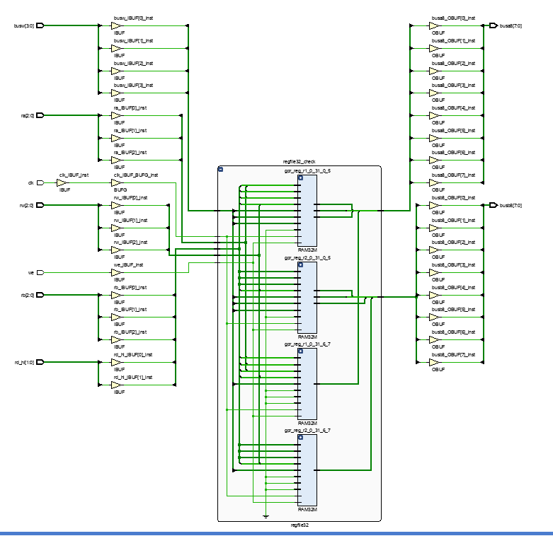
#### 实验数据仿真测试波形图
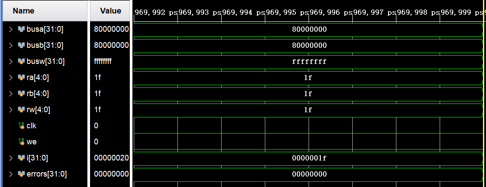
#### 开发板验证
第一张图表示零号寄存器无法写入数据，第二张图片表示在一号寄存器中写入 7 并且读出。第三张图再在三号寄存器写入 5 并且读出。
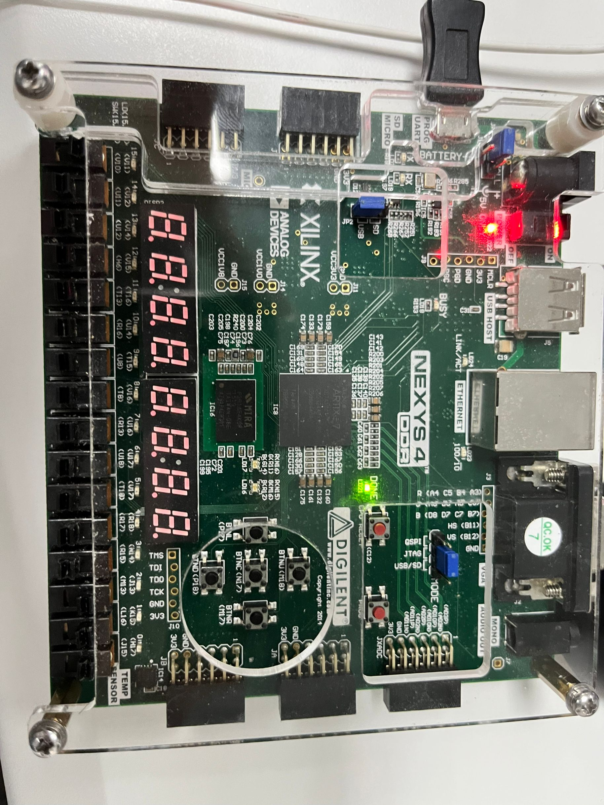
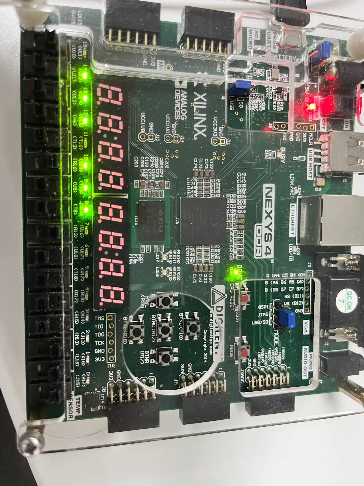
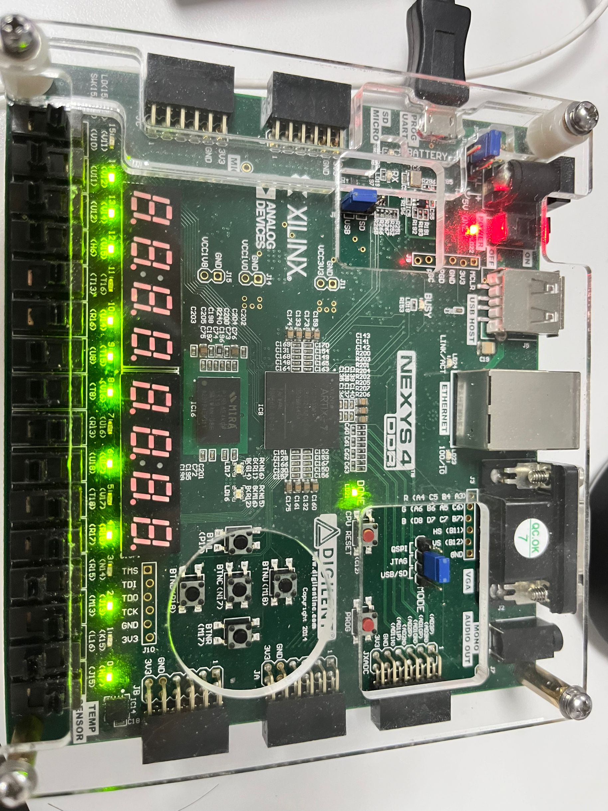

#### 错误现象及分析
在这次实验中，将时钟信号对应到了开发板中的一个按钮来触发，在检验的时候发现读写操作都不会让 led 灯闪烁，误以为是代码实现不正确，最后发现是没有输入时钟信号。

同时零号寄存器不应该进行写入，这一开始被遗漏了。
```verilog
if (ra != 0) begin
    busa = gpr[ra]; end
if (rb != 0) begin
    busb = gpr[rb]; end 
```
### 实验二：比特流加密实验
#### 整体方案设计：
比特流加密通过异或操作来实现，原始数据与密钥异或后即为加密，再一次与密钥异或后即可解密。同时，对于每一个字符，可以通过 64 位线性移位寄存器来生成不同的密钥，并利用 seed 来初始化，使其可以重现密钥。具体实现通过先实现一个子模块 LFSR，当 load 信号为高电平时，载入 seed，否则每一次右移一次，并设计移入为 rin = x0 ^ x1 ^ x3 ^ x4。对于比特流加密模块，主要是需要控制周期数来控制 ready 信号（此为时序逻辑），当 ready 为 1时，则说明可以载入 dataout 的数据（这里可以看作组合逻辑）。
#### 顶层模块设计：
1. LFSR 64位线性移位寄存器
2. 比特流加密模块
#### 描述与定义：
1. LFSR 64位线性移位寄存器
   输入端口：
   1. 64位 seed 作为加密的种子
   2. 1位load 信号控制是否载入
   3. 时钟信号 clk
   输出端口：
   1. 64位 dout 表示当前周期的寄存器内容
2. 比特流加密模块
   输入端口：
   1. clk 时钟信号
   2. 1 位load 信号
   3. 8位 datain 作为输入数据的 8位 ASCII码
   输出端口：
   1. 6位 key 作为当前的密钥
   2. 1位 ready 标志，表示当前周期进行加密
   3. 8位 dataout 输出加密后的 8位 ASCII码数据。

#### 关键的设计语句/源代码
下面分别为 LFSR 模块、比特流加密模块的关键语句
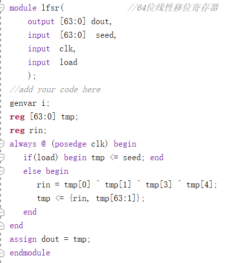
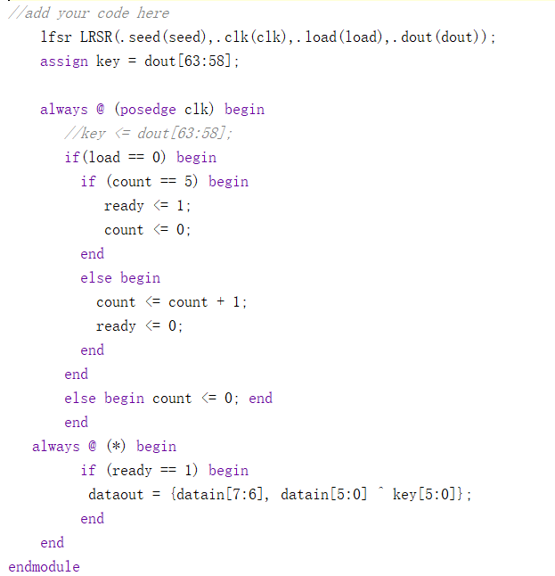
#### 综合设计图
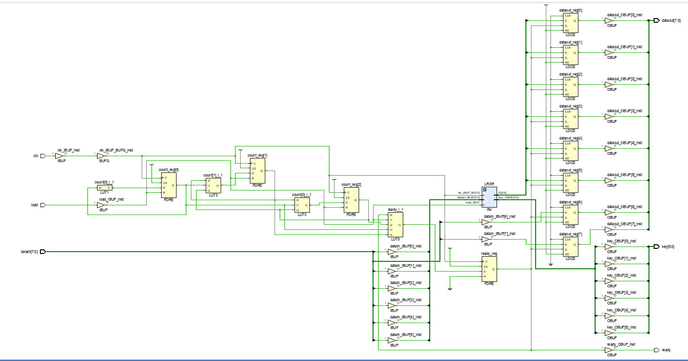
#### 实验数据仿真测试波形图
其中 store 信号并不需要，故为 XX
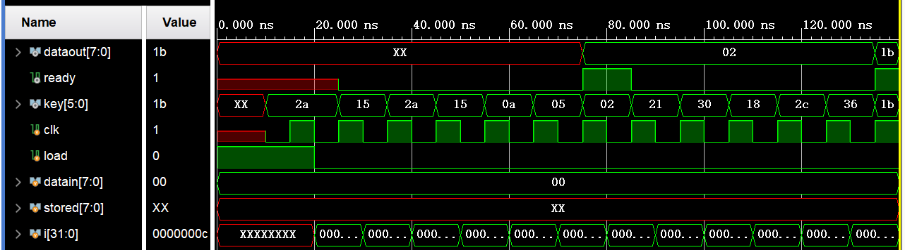
#### 开发板验证
下图为加密0x57时的情况，看到得到0x55，同时若把下方输入调整为 0x55，那么就得到了 0x57。
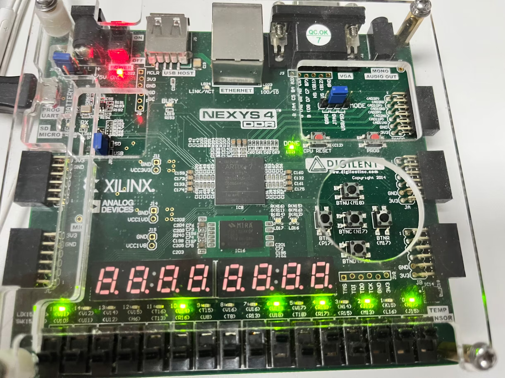
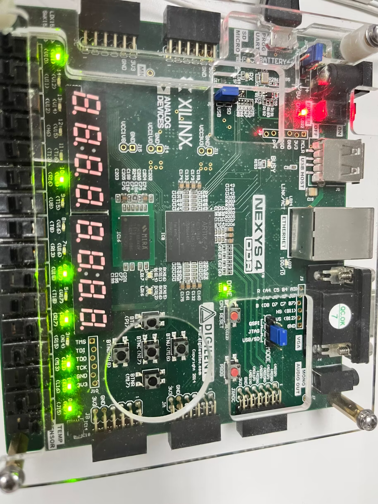
#### 错误现象及分析
一开始将 LFSR 反馈逻辑写成了这样
```verilog
tmp <= {rin, tmp[62:0]}
```
实际上应该是：
```verilog
tmp <= {rin, tmp[63:1]}
```
其次，key 信号应该连接到 dout 信号上随着其变化，而我最开始将key 信号写在了 always @(clk) 模块里，导致两者变化不统一，实际上应该作为 wire 变量直接assign赋值.
```verilog
 assign key = dout[63:58];
```

最后，当 ready 为 1时，则说明可以立刻载入 dataout 的数据，否则与 ready 不在同一周期中。
```verilog
always @ (*) begin
    if (ready == 1) begin
    dataout = {datain[7:6], datain[5:0] ^ key[5:0]};
    end
end
```

### 实验三：数字时钟实验
#### 整体方案设计：
在数字时钟实验中，需要完成重置时间功能，对秒钟、分钟、小时的置位功能，以及正常的时钟计时功能。同时需要在整点的时候使得 led 灯闪亮五秒钟（特别地，在23：59：59下一秒，需要闪烁十秒钟）。具体实现需要进行时钟信号的分频，数字时钟进位逻辑，开发板数码管“同时”显示等功能。
#### 顶层模块设计：
1. 分频逻辑
2. 数字时钟逻辑
3. 开发板数码管显示模块
#### 描述与定义：
输入信号：
1. 时钟信号 clk
2. 重置信号 rst
3. 两位 s 作为功能选择信号，00为正常计时，01为小时置位，10 为分钟置位，11为秒钟置位。
输出信号：
1. 七位 segs 表示当前周期数码管应该显示的数字
2. 八位 an 表示当前周期哪一位数码管应该显示
3. 三位 ledout 作为整点时三色指示灯闪烁信号
#### 关键的设计语句/源代码
主要分频逻辑
```verilog
always @ (posedge clk) begin
  if (counter == 99999999) begin // 分频出 1s
     counter <= 0;
     //oneSec <= ~oneSec;
  end else begin
     counter <= counter + 1;
  end
  // 用于同时点亮数码管 若为 2 | 5 则跳过，因为数码管 2 5 均不显示
  // 分频出 500 Hz
  if (counter0 == 200000) begin
      counter1 <= counter1 + 1; 
      counter0 <= 0;
      end      
  else begin 
      counter0 <= counter0 + 1;
  end
      
  if (counter1 == 2 || counter1 == 5) begin 
      counter1 <= counter1 + 1;
  end
  else if (counter1 == 8) begin 
     counter1 <= 0;
  end
```
整点闪烁逻辑
```verilog
  if (carry1 == 1 && counter2 <= 5) begin  // 用于五秒闪烁led
     if (counter == 99999999) begin 
     counter2 <= counter2 + 1; end
     ledout[0] <= (counter2 % 3) % 2;
     ledout[1] <= ((counter2 + 1) % 3 ) % 2;
     ledout[2] <= ((counter2 + 2) % 3 ) % 2;
  end 
  else if (carry2 == 0) begin
     counter2 <= 0;
     carry1 <= 0;
     ledout[0] <= 0;
     ledout[1] <= 0;
     ledout[2] <= 0;
  end
```
数字时钟逻辑
```verilog
if(s == 2'b00) begin
  if (counter == 99999999) begin
    if (sec_lo == 9) begin
      sec_lo <= 0;
      if (sec_hi == 5) begin
        sec_hi <= 0;
        if (min_lo == 9) begin
          min_lo <= 0;
          if (min_hi == 5) begin
            min_hi <= 0;
            if (hour_lo == 3 && hour_hi == 2) begin
              hour_lo <= 0;
              hour_hi <= 0;
              carry2 <= 1;
            end else if (hour_lo == 9) begin
              hour_lo <= 0;
              hour_hi <= hour_hi + 1;
              carry1 <= 1;
            end else begin
              hour_lo <= hour_lo + 1;
              carry1 <= 1;
            end
          end else begin
            min_hi <= min_hi + 1;
          end
        end else begin
          min_lo <= min_lo + 1;
        end
      end else begin
        sec_hi <= sec_hi + 1;
      end
    end else begin
      sec_lo <= sec_lo + 1;
    end
  end
  end
  else if (s == 2'b01) begin 
    hour_hi <= data_h;
    hour_lo <= data_l;
  end
  else if (s == 2'b10) begin
    min_hi <= data_h;
    min_lo <= data_l;
  end
  else if (s == 2'b11) begin
    sec_hi <= data_h;
    sec_lo <= data_l;
  end
```

数码管显示逻辑:
```verilog
// 共阳极 因此取反
case (counter1) // counter1 分频出 500Hz
      3'b000: an <= ~(8'b00000001); 
      3'b001: an <= ~(8'b00000010);
      3'b010: an <= ~(8'b00000100);
      3'b011: an <= ~(8'b00001000);
      3'b100: an <= ~(8'b00010000);
      3'b101: an <= ~(8'b00100000);
      3'b110: an <= ~(8'b01000000);
      3'b111: an <= ~(8'b10000000);
  endcase
    // 根据需要点亮的数码管确定对应数字
    case (counter1)
      3'b000: number <= sec_lo; 
      3'b001: number <= sec_hi;

      3'b011: number <= min_lo;
      3'b100: number <= min_hi;

      3'b110: number <= hour_lo;
      3'b111: number <= hour_hi;
  endcase
    // 将应该点亮的数字对应到 segs 七段数码管中
   case(number)
            4'b0000:segs <= 7'b1000000;
            4'b0001:segs <= 7'b1111001;
            4'b0010:segs <= 7'b0100100;
            4'b0011:segs <= 7'b0110000; 
            4'b0100:segs <= 7'b0011001;
            4'b0101:segs <= 7'b0010010;
            4'b0110:segs <= 7'b0000010;
            4'b0111:segs <= 7'b1111000;
            4'b1000:segs <= 7'b0000000;
            4'b1001:segs <= 7'b0010000;
   endcase
```
#### 综合设计图
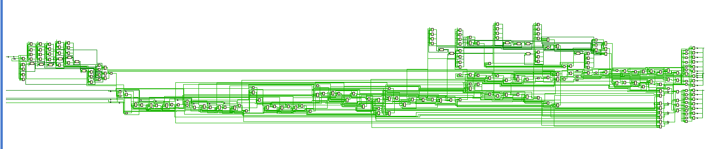
#### 实验数据仿真测试波形图
由于仿真时间过短，因此 segs an 显示不确定
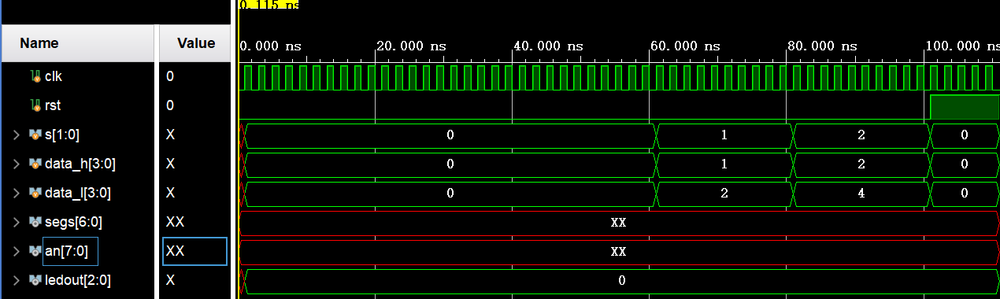
#### 开发板验证
<div style="float:left;border:solid 1px 000;margin:2px;">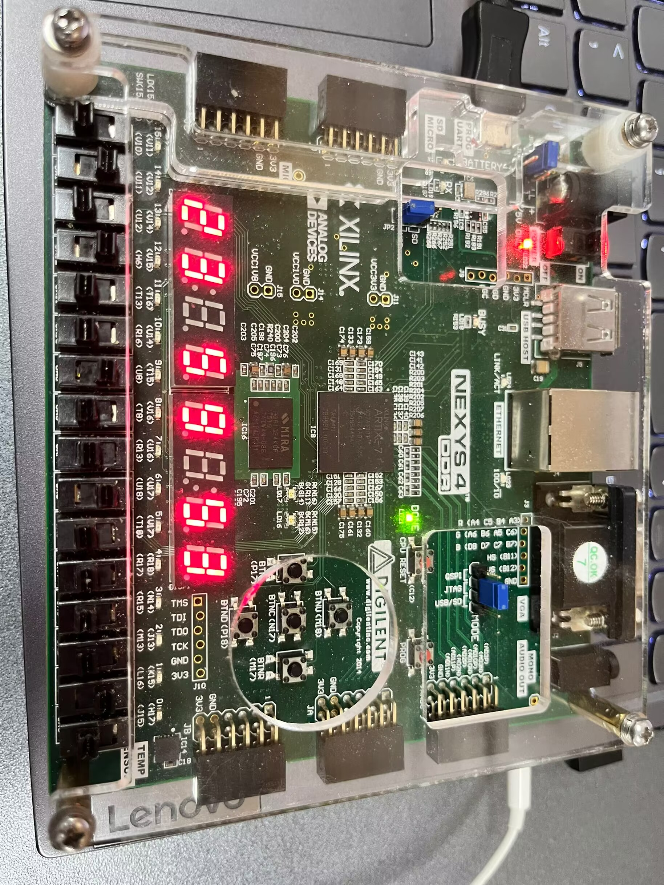</div>
<div style="float:left;border:solid 1px 000;margin:2px;">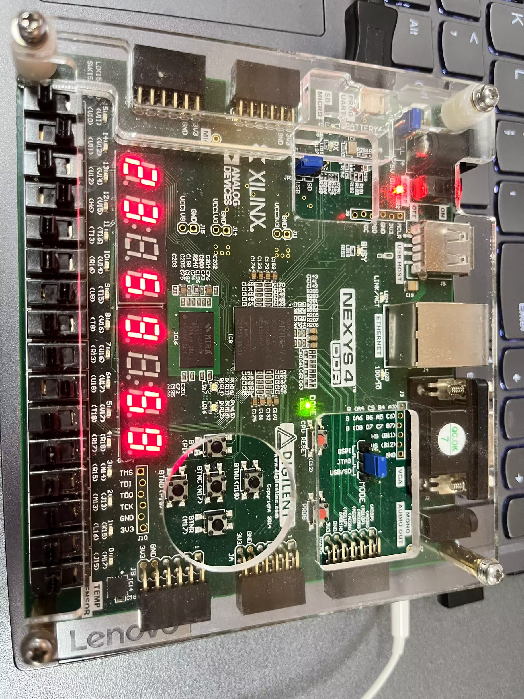</div>

<div style="float:left;border:solid 1px 000;margin:2px;">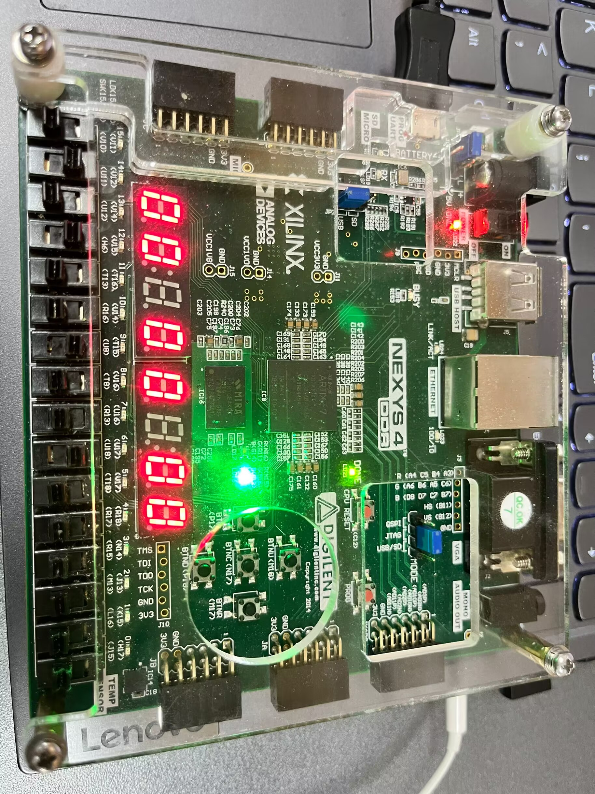</div>
<div style="float:left;border:solid 1px 000;margin:2px;">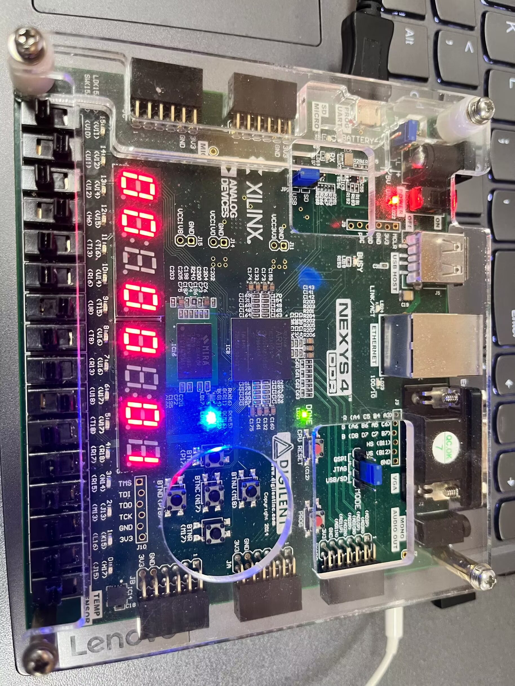</div>

<div style="float:left;border:solid 1px 000;margin:2px;">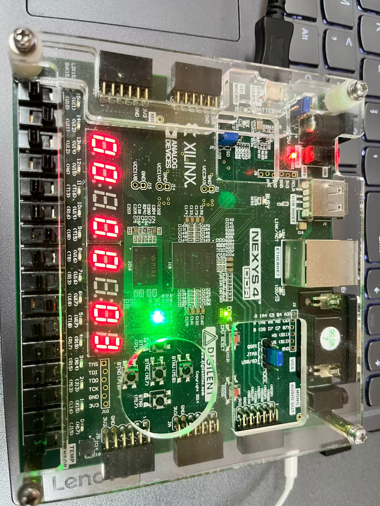</div>
<div style="float:left;border:solid 1px 000;margin:2px;">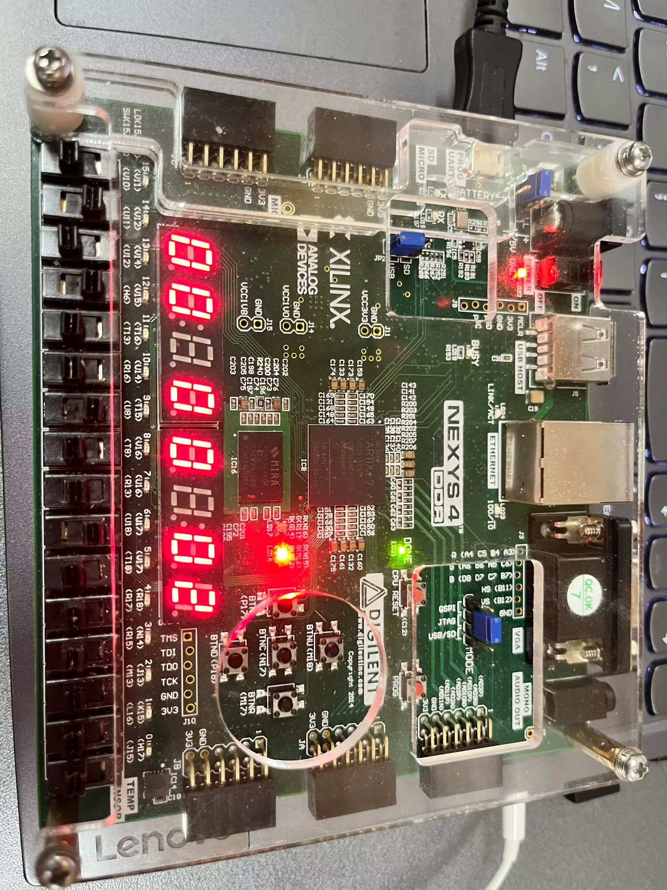</div>

<div style="float:left;border:solid 1px 000;margin:2px;">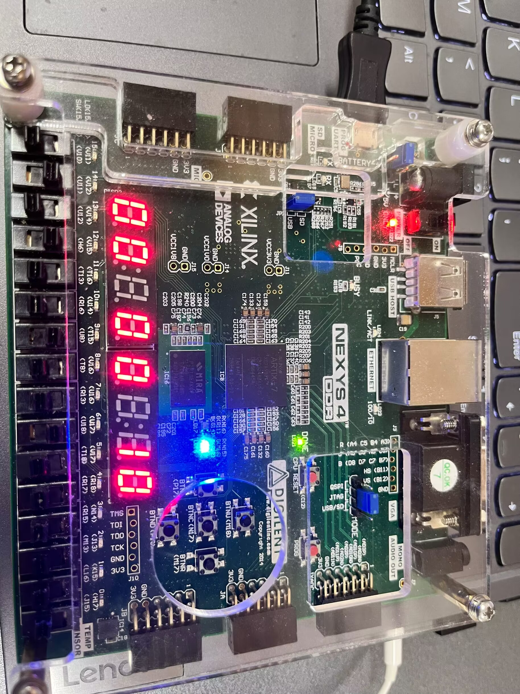</div>
<div style="float:left;border:solid 1px 000;margin:2px;">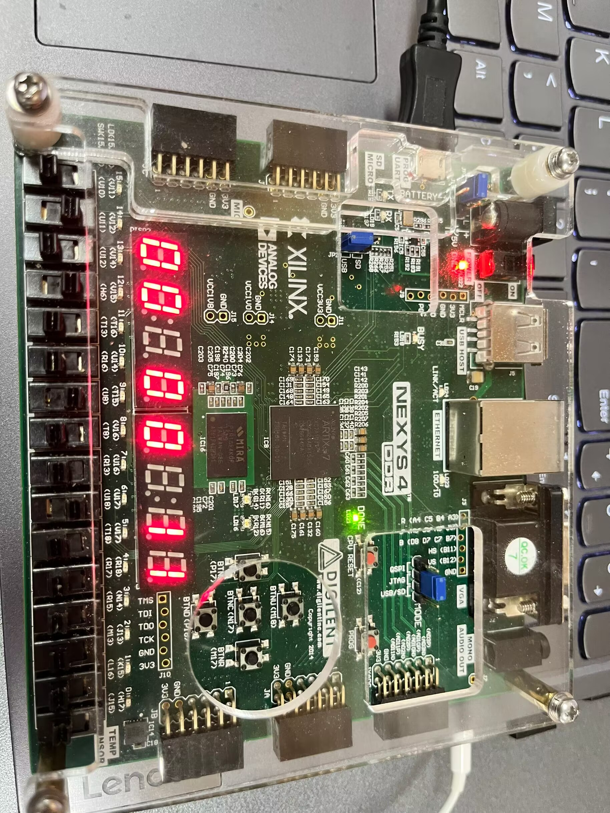</div>

#### 错误现象及分析
1. 分频不正确，导致八个数码管无法同时显示出正确的数字（同时有部分变量忘记用非阻塞赋值，导致显示有问题）
正确分频出 500Hz 和 1 Hz
```verilog
  if (counter == 99999999) begin // 分频出 1s
     counter <= 0;
     //oneSec <= ~oneSec;
  end else begin
     counter <= counter + 1;
  end
  // 用于同时点亮数码管 若为 2 | 5 则跳过，因为数码管 2 5 均不显示
  // 分频出 500 Hz
  if (counter0 == 200000) begin
      counter1 <= counter1 + 1; 
      counter0 <= 0;
      end      
  else begin 
      counter0 <= counter0 + 1;
  end
```   
2. 忘记将 led 轮换点亮, 下为正确轮换
```verilog
ledout[0] <= (counter3 % 3) % 2;
ledout[1] <= ((counter3 + 1) % 3 ) % 2;
ledout[2] <= ((counter3 + 2) % 3 ) % 2;
```
3. 忘记 Nexy4 开发板的数码管为共阳极，写成了高电平点亮，因此加个取反即可。
```verilog
  case (counter1)
      3'b000: an <= ~(8'b00000001); 
      3'b001: an <= ~(8'b00000010);
      3'b010: an <= ~(8'b00000100);
      3'b011: an <= ~(8'b00001000);
      3'b100: an <= ~(8'b00010000);
      3'b101: an <= ~(8'b00100000);
      3'b110: an <= ~(8'b01000000);
      3'b111: an <= ~(8'b10000000);
  endcase
```
### 思考题一：
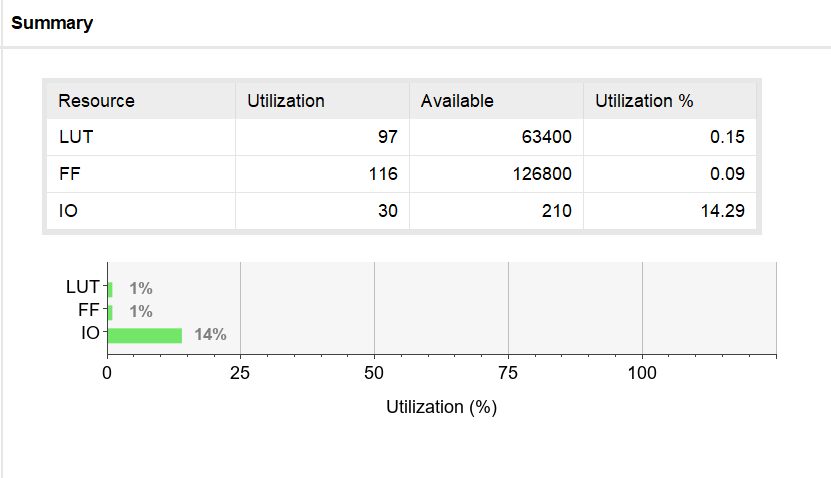
可以看到 LUT 与 触发器 FF 占用较少，主要为 IO 输入输出资源占用较多。
### 思考题二：
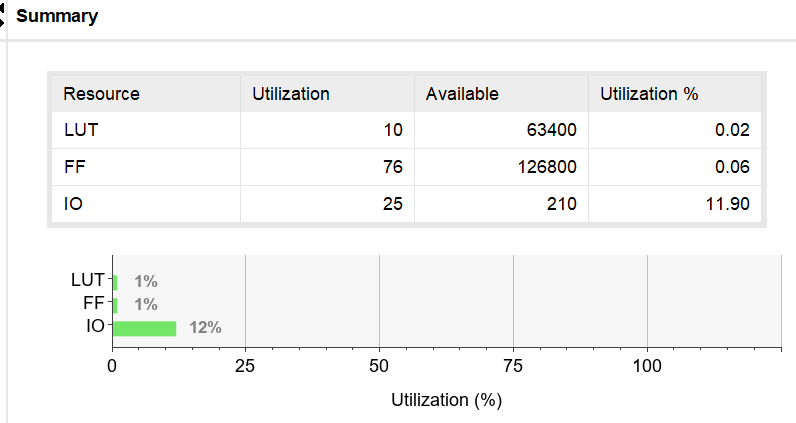
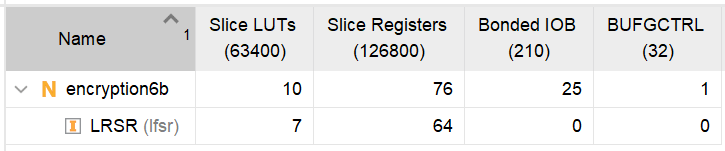
可以看到IO端口占比较高，但 FF 触发器数量较多。其中 LFSR 中调用的 FF 触发器资源为 64，相比这个程序而言较多。
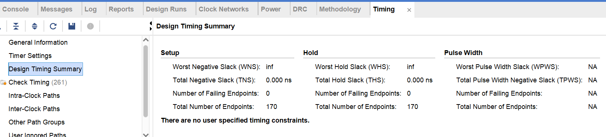
根据时序分析中可以看到其中 The number of EndPoints 数量较多，说明时序之间传输的端口较多。
查阅网上资料：找到使用用途较广的反馈方程
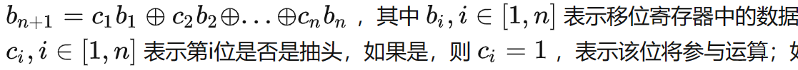
即使用 $c_i$ 来表示当前位是否进行异或操作，这相当于我们实验中使用的反馈方程的推广形式。
### 思考题三：
若要实现倒计时功能，只需要对实验三中的数字时钟逻辑部分进行修改即可，此时需要注意的是高位是否足够借位，因此需要加上诸多判断是否为 0 的情况，其次将累加改为每次减一即可：
```verilog
if (counter == 99999999) begin
    if (sec_lo == 0 && !(sec_hi==0 && min_lo==0 && min_hi==0 && hour_lo==0 && hour_hi==0)) begin
      sec_lo <= 9;
      if (sec_hi == 0 && !( min_lo==0 && min_hi==0 && hour_lo==0 && hour_hi==0)) begin
        sec_hi <= 5;
        if (min_lo == 0 && !( min_hi==0 && hour_lo==0 && hour_hi==0)) begin
          min_lo <= 9;
          if (min_hi == 0 && !( hour_lo==0 && hour_hi==0)) begin
            min_hi <= 5;
            if (hour_lo == 0 && hour_hi != 0) begin
              hour_lo <= 9;
              hour_hi <= hour_hi - 1;
            end else if(hour_lo != 0)begin
              hour_lo <= hour_lo - 1;
            end
          end else if (min_hi!=0)begin
            min_hi <= min_hi - 1;
          end
        end else if (min_lo!=0)begin
          min_lo <= min_lo - 1;
        end
      end else if (sec_hi!=0)begin
        sec_hi <= sec_hi - 1;
      end
    end else if(sec_lo!=0)begin
      sec_lo <= sec_lo - 1;
    end
  end
```
实现结果如下，数码管由于手机拍照因此亮度有点不清楚，但在人眼看来是十分清晰的。
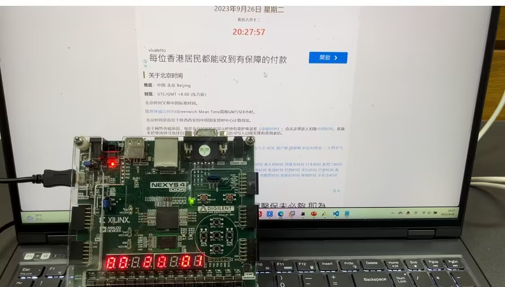
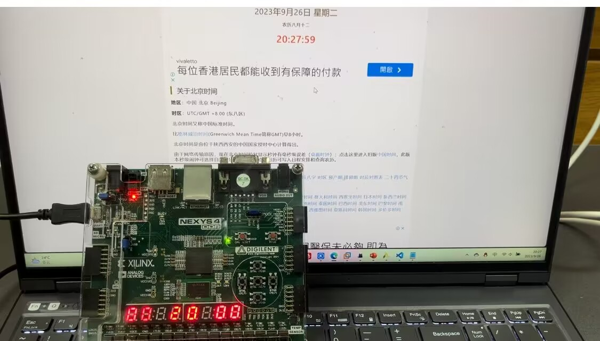
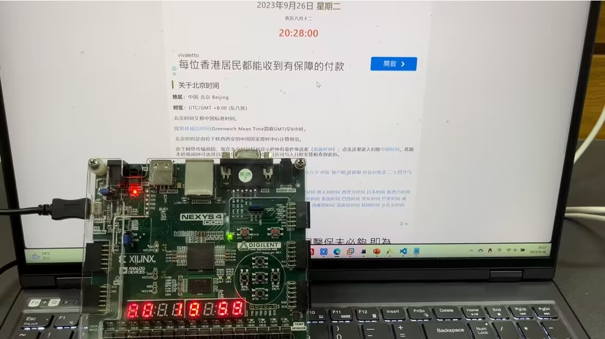


若要实现毫秒计时，同样也只需要在实验上进行修改即可，主要操作是将分频出的 1 Hz 改成 1000 Hz，因此修改该部分即可。同时需要修改具体的进位，当毫秒达到999时进行进位即可，具体逻辑同理。
```verilog
if (counter == 99999) begin
...
end
```