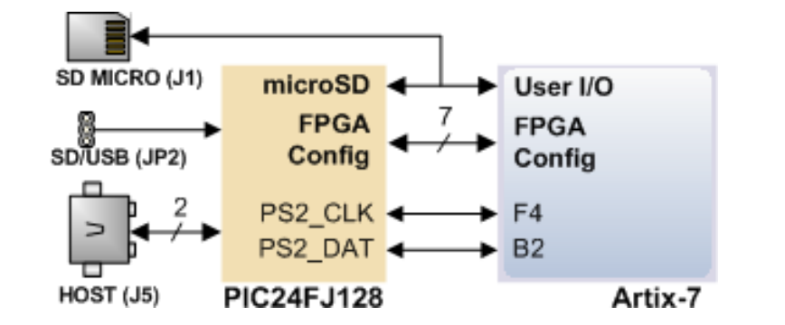
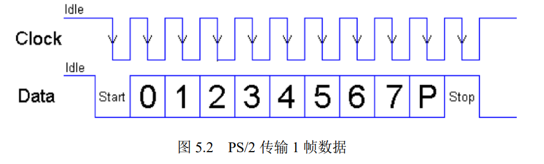

## 姓名：陈力峥  
## 学号：221240093

## 实验内容
### 实验一：键盘接口实验
#### 整体方案设计：
实验板上的微控制器 PIC24 为 Nexys A7 提供 USB HID Host 功能，进入主机状态后连接键盘可以根据 PS2_CLK, PS2_DATA 得到键盘输入的信号。同时需要对于键盘的输入需要进行去重和消抖，当按一下一个按键后松开，会按照顺序发送该按键的扫描码和以及松开后的断码、扫描码（共三个数据）。在该实验中，需要在去重和消抖的情况下读取键盘发送而来的信号，进行按键次数的计数，并且将扫描码、计数结果、对应 ascii 码显示到数码管上，同时需要考虑键盘输入溢出的情况。
#### 顶层模块设计：
1. 去重模块debouncer
2. 键盘信号接收KeyBoardReceiver
3. 顶层模块KeyboardSim对应开发码的输入
#### 描述与定义：
1. 去重模块 debouncer
   1. 输入端口
      1. clk 时钟信号
      2. I0：用于键盘输入的kb_clk
      3. I1：用于键盘输入的kb_data
   2. 输出端口
      1. O0：去重后的键盘输入kb_clk的输出
      2. O1：去重后的键盘输入kb_data的输出
2. 键盘信号接收 KeyboardReceiver
   1. 输入端口
      1. clk 时钟信号
      2. kb_clk 键盘传输数据的时钟信号
      3. kb_data 键盘传输的一位数据
      4. reset 重置信号
   2. 输出端口
      1. ready信号表示当前数据传输完成
      2. 32位keycodeout 输出表示连续接收四次的键盘扫描码
      3. 8位 count 对键盘按下的次数进行计数
      4. 1位 numlock 表示当前 numlock 的状态，为 1时表示 numlock 处于启动状态
      5. 1位 capslock 表示当前 capslock 的状态，为1时表示当前为大写锁定状态
3. KeyboardSim 模块
   1. 输入端口
      1. CLK100MHZ 表示系统的时钟信号
      2. PS2_CLK 为来自键盘的时钟信号
      3. PS2_DATA 来自键盘的串行数据位
      4. 一位BTNC为重置信号，上升沿进行重置
   2. 输出端口
      1. 7位 SEG 控制数码管的显示
      2. 8位 AN 控制当前为哪一个数码管发亮
      3. 16 位 LED 对应开发板上的 LED 灯，用于表示是否按下某些特殊按键
#### 实验原理图：


#### 关键的设计语句/源代码
用 tail 控制 buffer 区域的输入，用 head 控制 buffer 区域的读取，当两者重合时表示 buffer 区域已满，发生溢出

数据读取逻辑
```verilog
always@(posedge Hz_250 or posedge reset)begin
    if(reset == 1)
    begin
    head <= 0;
    datacur <= 0;
    end
    else if (flag == 1) flag <= 0;
    else if(overflow != 1)begin
        datacur[0]<=buffer[head];
        datacur[1]<=buffer[head+1];
        datacur[2]<=buffer[head+2];
        datacur[3]<=buffer[head+3];
        datacur[4]<=buffer[head+4];
        datacur[5]<=buffer[head+5];
        datacur[6]<=buffer[head+6];
        datacur[7]<=buffer[head+7]; 
        flag<=1'b1;     //已接收8位有效数据
        head <= (head+8) % 64;
    end
end
```
缓冲区载入
```verilog
    case(cnt)
    0:readyflag <= 0;
    1:buffercur[0] <= kdataf;
    2:buffercur[1] <= kdataf;
    3:buffercur[2] <= kdataf;
    4:buffercur[3] <= kdataf;
    5:buffercur[4] <= kdataf;
    6:buffercur[5] <= kdataf;
    7:buffercur[6] <= kdataf;
    8:buffercur[7] <= kdataf;
    9:begin
        if (bufferprev != buffercur)  begin // modify
        buffer[tail] <= buffercur[0];
        buffer[tail+1] <= buffercur[1];
        buffer[tail+2] <= buffercur[2];
        buffer[tail+3] <= buffercur[3];
        buffer[tail+4] <= buffercur[4];
        buffer[tail+5] <= buffercur[5];
        buffer[tail+6] <= buffercur[6];
        buffer[tail+7] <= buffercur[7];
        bufferprev <= buffercur;
        tail <= (tail + 8) % 64;
        if ((tail + 8) % 64 == head) overflow <= 1;
        end
        end 
    10: readyflag <= 1;
    endcase
    if(cnt <= 9) cnt <= cnt + 1;
    else cnt <= 0;
```
特殊按键 以及 计数器计数逻辑
```verilog
if(datacur[7:0] == 88 && dataprev != 240) tmp_capslock <= ~tmp_capslock;
if(datacur[7:0] == 119 && dataprev != 240) tmp_numlock <= ~tmp_numlock;

if(onetap == 3) onetap = 1;
else onetap = onetap + 1;
if(count == 255) count = 0;
else if (onetap == 1)count = count + 1;
```
#### 综合设计图

#### 开发板验证
下列图为开发板验证：1，2图表示按下 a 键以及按下 shift + a 为大写 A 键的结果（共三次计数）
3，4图表示按下特殊按键时 LED 亮起
5，6图分别表示 capslock 的按键在松开后 LED 仍然保持发亮的状态，以及 buffer 缓冲区满了之后溢出的结果
<div style="float:left;border:solid 1px 000;margin:2px;"></div>
<div style="float:left;border:solid 1px 000;margin:2px;"></div>

<div style="float:left;border:solid 1px 000;margin:2px;"></div>
<div style="float:left;border:solid 1px 000;margin:2px;"></div>

<div style="float:left;border:solid 1px 000;margin:2px;"></div>
<div style="float:left;border:solid 1px 000;margin:2px;"></div>

#### 错误现象及分析
最开始计数器的实现有问题，当按住一个键不放的时候，计数器会不断增加，但实际上只需要再加上一个标志进行判断即可。
### 实验二：鼠标接口实验
#### 整体方案设计：
鼠标连接 USB 端口，发送测试成功的数据之后，可以进行数据的上传，以每帧 11 位数据的方式连续上传四次，具体格式见下图需要正确地读入这些数据并且显示在数码管上
#### 顶层模块设计：
1. MouseReceiver 模块
2. 数码管显示模块
#### 描述与定义：
MouseReceiver 模块
1. 输入端口
   1. 系统时钟 CLK100MHZ
   2. 鼠标时钟 PS2_CLK
   3. 鼠标数据 PS2_DATA
2. 输出端口
   1. LeftButton，MidButton，RightButton 分别表示鼠标左键 中键 右键是否按下，按下时 LED 闪亮
   2. SEG，AN 同上，为数码管显示控制信号 
#### 关键的设计语句/源代码
直接读入四帧数据
```verilog
always @(negedge PS2_CLK)
begin
    case(cnt)
        //开始位
        0: ;
        1:data[0]<=PS2_DATA;
        2:data[1]<=PS2_DATA;
        3:data[2]<=PS2_DATA;
        4:data[3]<=PS2_DATA;
        5:data[4]<=PS2_DATA;
        6:data[5]<=PS2_DATA;
        7:data[6]<=PS2_DATA;
        8:data[7]<=PS2_DATA;
        9:flag <=1'b1;        //已接收8位有效数据
        10:flag<=1'b0;       //结束位
        11: ;
        12:data[8]<=PS2_DATA;
        13:data[9]<=PS2_DATA;
        14:data[10]<=PS2_DATA;
        15:data[11]<=PS2_DATA;
        16:data[12]<=PS2_DATA;
        17:data[13]<=PS2_DATA;
        18:data[14]<=PS2_DATA;
        19:data[15]<=PS2_DATA;
        20:flag <=1'b1;        //已接收8位有效数据
        ......
          endcase
        if(cnt<=42) cnt<=cnt+1;
        else if(cnt==43)  cnt<=0;
end
```
对应到各个端口上
```verilog
assign X = data[15:8];
assign Y = data[23:16];
assign Z = data[27:24];
assign XY = data[6];
assign YY = data[7];
assign XS = data[4];
assign YS = data[5];
assign ZS = data[27];
assign LeftButton = data[0];
assign RightButton = data[1];
assign MidButton = data[2];
//assign MidButton = data[2];
assign seg7_data[3:0] = (data[27] == 1 ?~Z + 1 : Z);
assign seg7_data[7:4] = (ZS == 1 ? 1:0);
assign seg7_data[15:8] = (data[23] == 1 ? ~Y + 1 : Y);
assign seg7_data[27:20] = (data[15] == 1 ?~X + 1 : X);
assign seg7_data[19:16] = (XS == 1 ? 1: 0);
assign seg7_data[31:28] = (YS == 1 ? 1: 0);
```
#### 综合设计图

#### 开发板验证
下列图片按照顺序展示了 鼠标向各个方向移动，鼠标滚轮移动以及按下按键的显示情况
<div style="float:left;border:solid 1px 000;margin:2px;"></div>
<div style="float:left;border:solid 1px 000;margin:2px;"></div>

<div style="float:left;border:solid 1px 000;margin:2px;"></div>
<div style="float:left;border:solid 1px 000;margin:2px;"></div>

<div style="float:left;border:solid 1px 000;margin:2px;"></div>
<div style="float:left;border:solid 1px 000;margin:2px;"></div>

<div style="float:left;border:solid 1px 000;margin:2px;"></div>
<div style="float:left;border:solid 1px 000;margin:2px;"></div>

#### 错误现象及分析
1. 在刚拿到开发板的时候错误配置了 JP1 JP2 端口，直到这个实验才发现会导致无法正常读入鼠标传输的信号，当调整正确后可以正常读入。

2. 在一下子读取四帧数据的时候，计数器的位数并不够，导致一直无法正常读取数据，并且这个问题检查了很久，难以发现。
```verilog
reg [6:0] cnt;
```
### 思考题一：
当出现了干扰可能导致数据传输出错的情况，这时候就应该要使用到 11 位数据的除了中间 8位数据位的其余数据。首先应该检查开始位 停止位是否正常，其次更应该检查奇偶检验位，根据奇偶检验位可以判断当前传输的数据是否被破坏，可以类比汉明码纠错的原理。可以很容易的进行数据传输正确与否的检验。
### 思考题二：
键位冲突即同时按下键盘上的几个按键时，系统不能对按键做出反应，得不到相应的结果。主要为薄膜键盘，按键冲突的主要原因为：当输入的几个按键中重叠的导线过多时，键盘可能会选择按照固定的输出按键输出固定的代码，从而忽视掉其中某一个按键的输入，造成按键冲突的情况。当今的主要解决方案是设计出按键与电路唯一对应的键盘，如机械键盘，这类键盘同时按下多个键的时候，由于各个键位的电路并不冲突，单独传输，因此不会发生键位冲突的情况。