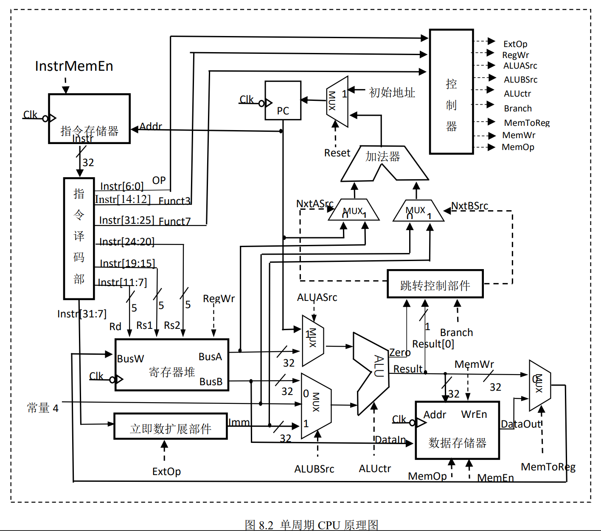
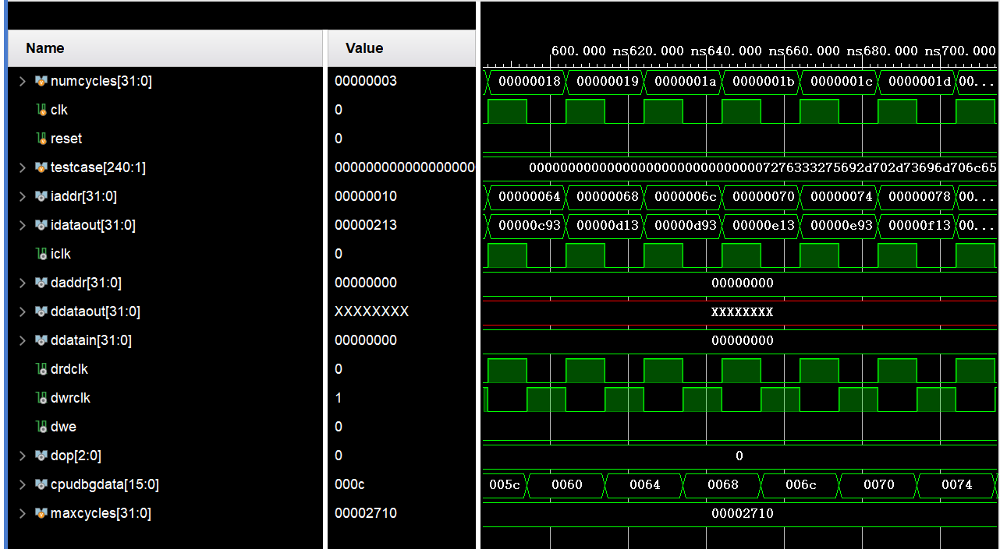
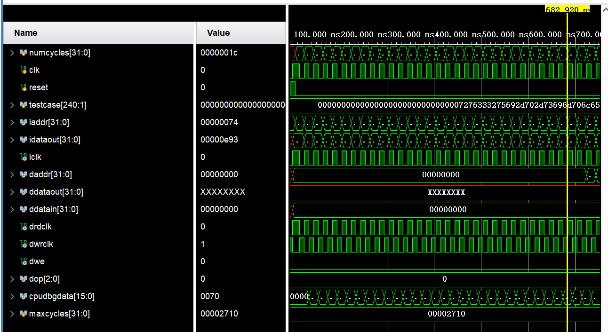
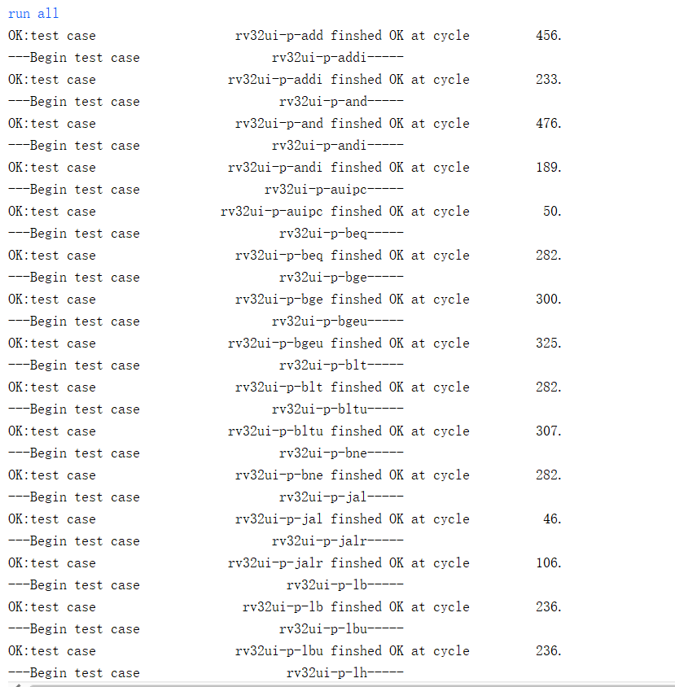
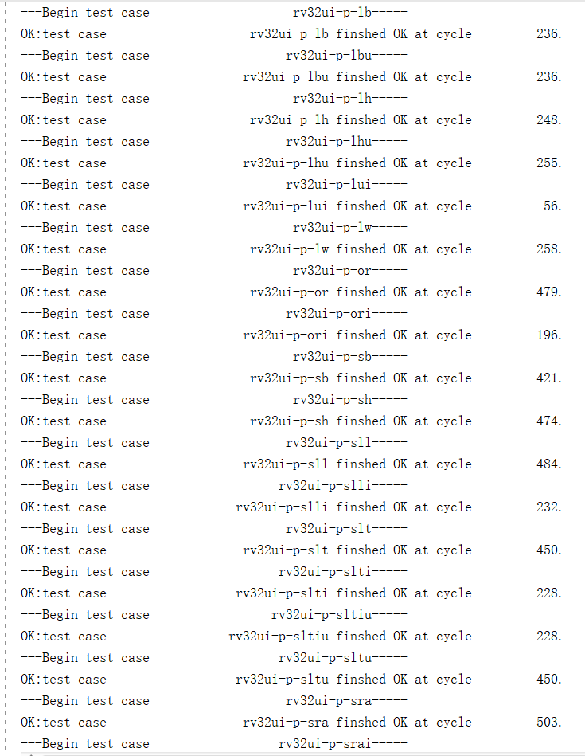
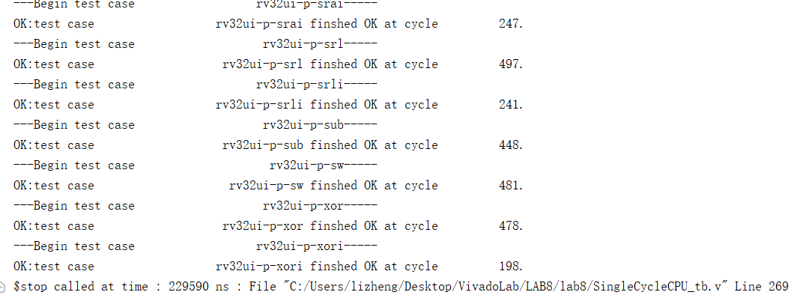
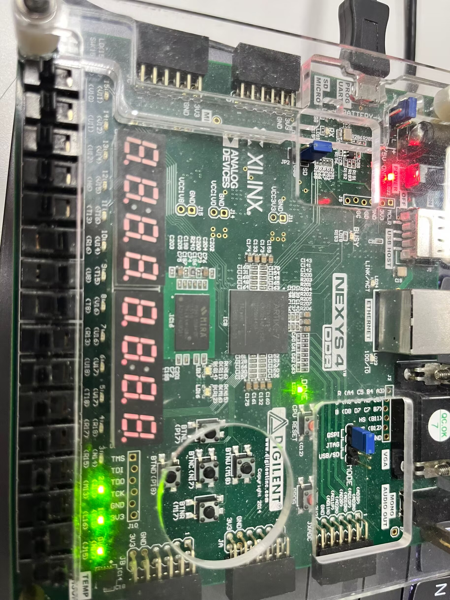
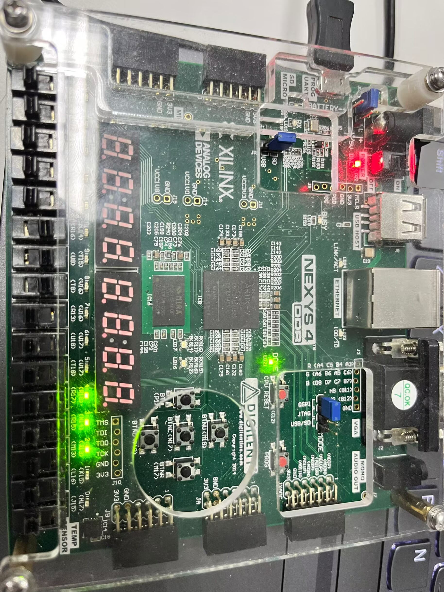
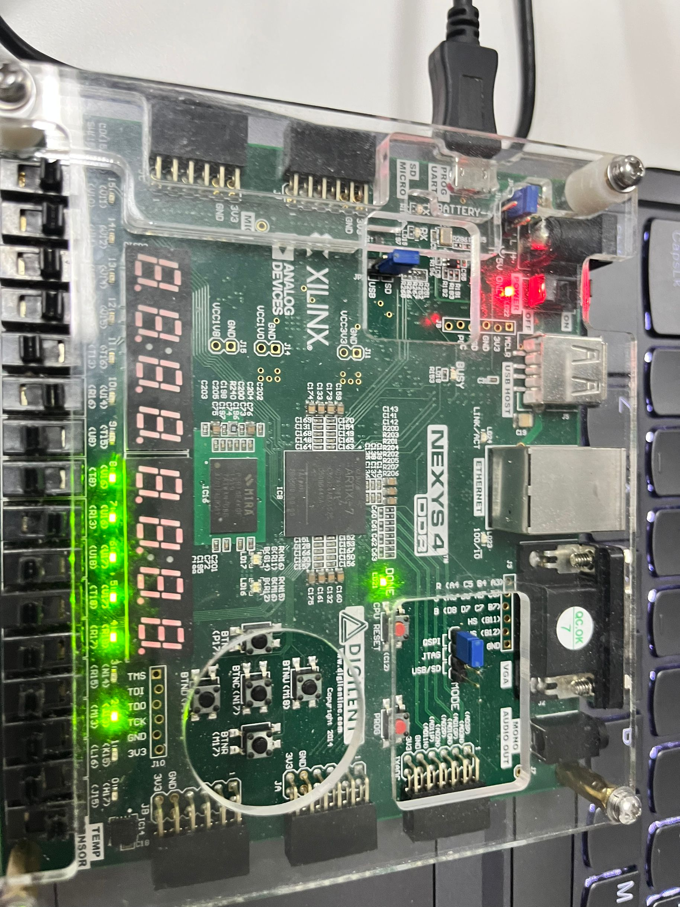
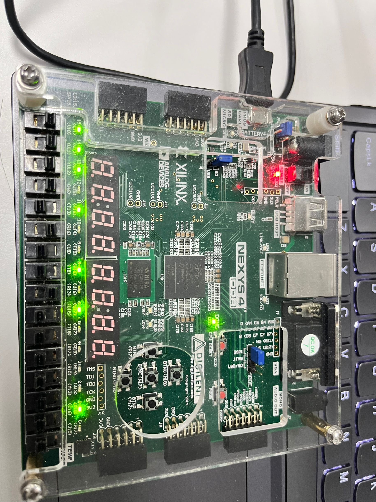

### 姓名：陈力峥  
### 学号：221240093

### 实验内容: 单周期 CPU 
#### 整体方案设计：
需要实现一个单周期的 CPU，更加具体的是需要实现下面这五个流程，这些操作都需要在一个时钟周期内完成。
1. 指令获取：根据程序计数器(PC)从指令存储器中读取指令。
2. 指令解码：解析指令的操作码和操作数，确定执行的具体操作。
3. 寄存器读取：根据指令中的寄存器地址，从寄存器文件中读取相应的数据。
4. 运算操作：根据指令的类型和操作数，使用ALU执行相应的算术或逻辑操作。
5. 结果存储：将运算结果存储到指定的寄存器或数据存储器中。
#### 顶层模块设计：
1. 数据通路(Data Path)：
    1. 程序计数器(PC)：存储当前指令地址，每个时钟周期根据控制信号决定是否更新。用一个特殊的寄存器进行实现
    2. 寄存器堆(Register File)：包含多个通用寄存器，用于存储数据。在前面的实验中已经实现。
    3. ALU(算术逻辑单元)：执行算术和逻辑运算，根据控制信号执行不同的操作。
    4. 数据存储器(Data Memory)：存储数据，可以通过地址进行读取和写入操作。
    5. 指令存储器(Instruction Memory)：存储指令，是执行程序的核心思想。
2. 控制单元(Control Unit)：
    1. 指令解码(InstrParse)：根据当前指令的操作码(OpCode)和功能码(FunctCode)解析指令类型和执行操作。
    2. 立即数拓展模块：根据控制信号以及指令进行立即数拓展
    3. 控制信号生成(Control Unit)：根据解码结果生成控制信号，包括ALU控制信号、寄存器读写使能信号、数据存储器读写使能信号等。
    4. 状态更新(NextPC)：根据指令执行结果更新状态，例如更新程序计数器(PC)、更新寄存器内容等。
#### 描述与定义：
ALU，寄存器堆，数据存储器均已在前面的实验中实现。
```verilog
//指令存储器
module InstrMem(
 output reg [31:0] instr, //输出 32 位指令
 input [31:0] addr, //地址字长 32 位，实际有效字长根据指令存储器容量来确定
 input InstrMemEn, //指令存储器片选信号
 input clk //时钟信号，下降沿有效
 );
```
```verilog
//立即数拓展
module InstrToImm(
	input [31:0] instr,   //32位指令
	input [2:0] ExtOp,    //扩展控制码
	output reg [31:0] imm //立即数
);
```
```verilog
//指令译码
module InstrParse(
    output [6:0] opcode,     //指令编码7位
    output [4:0] rd,         //目的寄存器编号5位
    output [2:0] funct3,     //3位功能码
    output [4:0] rs1,        //源寄存器1编号5位
    output [4:0] rs2,        //源寄存器2编号5位
    output [7:0] funct7,     //7位功能码
    input [31:0] instr       //指令   
 );
```
```verilog
//控制单元
module Control(
    output reg [2:0] ExtOp, //立即数拓展信号
    output reg RegWr, // 寄存器写使能信号
    output reg ALUASrc, // ALU 操作数A控制信号
    output reg [1:0] ALUBSrc, // ALU操作数B控制信号
    output reg [3:0] ALUctr, // ALU 运算方式控制信号
    output reg [2:0] Branch, // 分支控制信号
    output reg MemtoReg, // 写回数据选择信号
    output reg MemWr, // 存储器写使能
    output reg [2:0] MemOp, // 存储器存取方式信号
    input [6:0] opcode, // 指令 opcode
    input [2:0] funct3, // 指令 funct3
    input [6:0] funct7, // 指令 funct7
    input ban // 相当于 halt
   );
```
```verilog
// 分支跳转控制
module BranchControl(
    output reg NxtASrc, NxtBSrc, // 跳转地址操作数选择信号
    input zero, result0, // ZF 以及 ALU 运算结果最低位
    input [2:0] Branch // Branch 信号
   );
```
```verilog
// PC更新模块
module nextPC(
input reset,
    output [31:0] nxtPC,     //下一个取指令地址，32位，取低16位
    input [31:0] BusA,       //BusA
    input [31:0] curPC, // 当前 PC
    input [31:0] Imm,   //立即数
    input NxtASrc, NxtBSrc   //选择信号，由分支控制部件产生
    );
```
```verilog
// 单周期 CPU
module SingleCycleCPU(
 	input 	      clock,
	input 	      reset,
	output [31:0] InstrMemaddr,      //指令存储器地址
	input  [31:0] InstrMemdataout,   //指令内容
	output        InstrMemclk,       // 指令存储器读取时钟，为了实现异步读取，设置读取时钟和写入时钟反相
	output [31:0] DataMemaddr,       //数据存储器地址
	input  [31:0] DataMemdataout,    //数据存储器输出数据
	output [31:0] DataMemdatain,     //数据存储器写入数据
	output 	      DataMemrdclk,      //数据存储器读取时钟，为了实现异步读取，设置读取时钟和写入时钟反相
	output	      DataMemwrclk,      //数据存储器写入时钟
	output [2:0]  DataMemop,         //数据读写字节数控制信号
	output        DataMemwe,         //数据存储器写入使能信号
	output reg [31:0] dbgdata,       //debug调试信号，输出16位指令存储器地址有效地址
	
	input [8:0] a0
);
```
#### 实验原理图：

#### 关键的设计语句/源代码
控制单元
```verilog
always@(*)begin
    if (ban) begin 
    ExtOp = 3'b000; RegWr = 1'b0; ALUASrc = 1'b0; ALUBSrc = 2'b00; ALUctr = 4'b0000; Branch = 3'b000;MemtoReg = 1'b0;MemWr=1'b0; MemOp = 3'b000;
    end
    else if(opcode == 7'b0110111)
        begin
         ExtOp = 3'b001; RegWr = 1'b1; ALUBSrc = 2'b10; ALUctr = 4'b1111; Branch = 3'b000;MemtoReg = 1'b0;MemWr=1'b0; 
        MemOp = 3'b000; ALUASrc = 1'b0; 
        end
    else if(opcode == 7'b0010111) 
        begin 
        ExtOp = 3'b001; RegWr = 1'b1; ALUASrc = 1'b1; ALUBSrc = 2'b10; ALUctr = 4'b0000; Branch = 3'b000;MemtoReg = 1'b0;MemWr=1'b0;
        MemOp = 3'b000;
        end
    else if(opcode == 7'b0010011)begin
    Branch = 3'b000;MemtoReg = 1'b0;MemWr=1'b0; MemOp = 3'b000;
        ExtOp = 3'b000;
        RegWr = 1'b1;
        ALUASrc = 1'b0; ALUBSrc = 2'b10;
        if(funct3 == 3'b101 && funct7[5] == 1'b1)begin 
            ALUctr = {1'b1, funct3};
        end
        else begin ALUctr = {1'b0, funct3}; end
    end
    else if(opcode == 7'b0110011)begin
    Branch = 3'b000;MemtoReg = 1'b0;MemWr=1'b0;
        RegWr = 1'b1; ALUctr = {funct7[5], funct3};
        ALUASrc = 1'b0; ALUBSrc = 2'b00;MemOp = 3'b000; ExtOp = 3'b000;
    end
    else if(opcode == 7'b1101111)begin
    Branch = 3'b001;MemtoReg = 1'b0;MemWr=1'b0;MemOp = 3'b000;
        ExtOp = 3'b100;RegWr = 1'b1;ALUASrc = 1'b1; ALUBSrc = 2'b01; ALUctr = 4'b0000;
    end
    else if(opcode == 7'b1100111)begin
        if(funct3 == 3'b000)
            begin ExtOp = 3'b000; RegWr = 1'b1; ALUASrc = 1'b1; ALUBSrc = 2'b01; ALUctr = 4'b0000; Branch = 3'b010;MemtoReg = 1'b0;MemWr=1'b0; MemOp = 3'b000;end
        else begin ExtOp = 3'b000; RegWr = 1'b0; ALUASrc = 1'b0; ALUBSrc = 2'b00; ALUctr = 4'b0000;Branch = 3'b000;MemtoReg = 1'b0;MemWr=1'b0; MemOp = 3'b000;end
    end
    else if(opcode == 7'b1100011)begin
        ExtOp = 3'b011; RegWr = 1'b0; ALUASrc = 1'b0; ALUBSrc = 2'b00;  MemOp = 3'b000;
        if(funct3 == 3'b000)begin ALUctr = 4'b0010; Branch = 3'b100;MemtoReg = 1'b0;MemWr=1'b0; end
        else if(funct3 == 3'b001)begin ALUctr = 4'b0010; Branch = 3'b101;MemtoReg = 1'b0;MemWr=1'b0;end
        else if(funct3 == 3'b100)begin ALUctr = 4'b0010;Branch = 3'b110;MemtoReg = 1'b0;MemWr=1'b0;end
        else if(funct3 == 3'b101)begin ALUctr = 4'b0010;Branch = 3'b111;MemtoReg = 1'b0;MemWr=1'b0;end
        else if(funct3 == 3'b110)begin ALUctr = 4'b0011;Branch = 3'b110;MemtoReg = 1'b0;MemWr=1'b0;end
        else if(funct3 == 3'b111)begin ALUctr = 4'b0011;Branch = 3'b111;MemtoReg = 1'b0;MemWr=1'b0;end
    end
    else if(opcode == 7'b0000011)begin
    Branch = 3'b000;MemtoReg = 1'b1;MemWr=1'b0;
    MemOp = funct3;
        ExtOp = 3'b000; RegWr = 1'b1; ALUASrc = 1'b0; ALUBSrc = 2'b10;ALUctr = 4'b0000;
    end
    else if(opcode == 7'b0100011)begin
    Branch = 3'b000;MemtoReg = 1'b0;MemWr=1'b1;MemOp = funct3;
        ExtOp = 3'b010; RegWr = 1'b0; ALUASrc = 1'b0; ALUBSrc = 2'b10;ALUctr = 4'b0000;
    end
end
```
单周期 CPU 模块
```verilog
reg [31:0] PC; 

wire done;
wire [31:0] instr;assign instr = InstrMemdataout;

assign done = (reset == 1'b1 ? 0 : (instr == 32'hdead10cc) ? 1 : 0);
always @(posedge clock or posedge reset) begin
    if (reset) PC <= 32'h00000000;
    else begin
        if (!done) PC <= nxtPC;
    end
end
assign InstrMemaddr = nxtPC;
assign InstrMemclk = clock; assign DataMemrdclk = clock; assign DataMemwrclk = ~clock;

always @(negedge clock) begin
    dbgdata <= PC;
end

wire [6:0]opcode;wire [4:0]rd;wire[2:0]funct3;wire [4:0]rs1;wire[4:0]rs2;wire[6:0]funct7;
InstrParse instrparse(.instr(InstrMemdataout),.opcode(opcode),.rd(rd),.funct3(funct3),.rs1(rs1),.rs2(rs2),.funct7(funct7));

wire [2:0]ExtOp;wire RegWr; wire ALUASrc; wire [1:0]ALUBSrc; wire[3:0]ALUctr;wire[2:0]Branch;wire MemtoReg;wire MemWr;wire [2:0]MemOp;
    Control cpucontrol(.opcode(opcode),.funct3(funct3),.funct7(funct7),.ExtOp(ExtOp), .ban(done | reset)
    ,.RegWr(RegWr),.ALUASrc(ALUASrc),.ALUBSrc(ALUBSrc),.ALUctr(ALUctr),.Branch(Branch),.MemtoReg(MemtoReg),.MemWr(MemWr),.MemOp(MemOp));

wire [31:0] imm;
    InstrToImm cpuimm(.imm(imm),.instr(InstrMemdataout),.ExtOp(ExtOp));
    
wire [31:0] busa; wire[31:0] busb; wire [31:0] busw; 
 regfile32 myregfile(.reset(reset),.busa(busa),.busb(busb),.clk(clock),.ra(rs1),.rb(rs2),.rw(rd),.we(RegWr),.busw(busw), .n(a0));   

wire [31:0] result;wire zero;
wire [31:0] dataa;wire [31:0]datab;
    assign dataa = (ALUASrc == 1'b1)? dbgdata : busa;
    assign datab = (ALUBSrc == 2'b00) ? busb : ((ALUBSrc == 2'b01) ? 32'h00000004 : imm);
    ALU32 cpualu(.result(result),.zero(zero),.dataa(dataa),.datab(datab),.aluctr(ALUctr));

wire [31:0] dataout;
assign DataMemaddr = result;
assign DataMemdatain = busb;
assign DataMemwe = (~reset & ~done & MemWr);
assign DataMemop = MemOp;
assign dataout = DataMemdataout;
assign busw = (MemtoReg == 1) ? dataout : result;

wire NxtASrc; wire NxtBSrc;
BranchControl mycpubranch(.NxtASrc(NxtASrc),.NxtBSrc(NxtBSrc),.zero(zero),.Branch(Branch),.result0(result[0]));
    nextPC cpunextPC(.nxtPC(nPC),.BusA(busa),.curPC(PC),.Imm(imm),.NxtASrc(NxtASrc),.NxtBSrc(NxtBSrc),.reset(reset | done));
    
always@(*)begin
    nxtPC = nPC;
end
```
#### 实验数据仿真测试波形图
以下包含仿真波形图以及 TestBench 结果





#### 开发板验证
<div style="float:left;border:solid 1px 000;margin:2px;"></div>
<div style="float:left;border:solid 1px 000;margin:2px;"></div>

<div style="float:left;border:solid 1px 000;margin:2px;"></div>
<div style="float:left;border:solid 1px 000;margin:2px;"></div>

#### 错误现象及分析
在设计单周期 CPU 的时候没有注意讲义中所说的在 100 MHZ 时钟频率之下可能一周期无法完成上述五个操作，导致程序无法正确执行完成，对时钟信号进行分频即可。


### 思考题一：
首先是对资源利用率有差别，独立的比较要额外的硬件资源，可能会增加成本和电路复杂性。相比之下，利用减法运算来实现比较运算可以在CPU内部使用现有的算术逻辑单元(ALU)，不需要额外的硬件资源。
独立的比较器件更加灵活性，可以使得 ALU 的功能更加简洁，使得整个 CPU 更加模块化，更易于调试改进，而利用减法运算来实现比较运算可能会受到CPU内部 ALU 的限制，可能无法灵活地适应不同的比较需求。
### 思考题二：
单周期 CPU 中指令存储器的读操作必须是异步读取，即 PC 寄存器内容更新后，立即读取到下一条指令，因为是单周期 CPU，所有操作必须在一个周期内完成，并且写回操作耗时应该是较高的，因此进行异步读取指令，可以立刻进行指令译码，立即数拓展，寄存器读取等操作，从而降低延迟，在同一个周期完成操作。
对于寄存器堆的读写。写操作通常是同步的，即在时钟上升沿触发。在该时钟上升沿时，将写入的数据存储到指定的寄存器地址中。而读操作可以是异步的，因为读取寄存器的数据不需要受到时钟的约束。而要做到写入之后读取，只要
### 思考题三：
如果还需要支持 RISCV M 指令集，其中主要包含各种乘法指令，除法指令以及取余指令等等，为了支持这些指令，首先需要拓展控制单元产生的控制信号，使得能够产生支持上述指令的各个信号，并且另一个需要进行改变的是执行阶段，可以对 ALU 运算单元进行拓展，使其支持乘除取余等操作。


