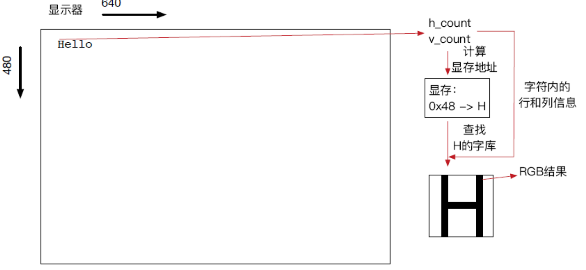

### 姓名：陈力峥  学号：221240093

### VGA-Xterminal 实验
#### 整体方案设计：
综合键盘信号接收实验和 VGA 显示实验来完成 Xterminal 实验，通过键盘实验来实现字符命令的输入，即终端与用户的交互功能，而 VGA 实验实现了将终端命令和图片显示在显示屏上。键盘信号接收实验在上一个实验已经完成，这边只需要简单修改几个端口即可。而 VGA 实验主要由 VGA_CTRL 以及 VGA_DRAW 两个模块构成。其实显示的原理就是用 VGA_CTRL 来控制当前显示的位置，VGA_DRAW 来控制显示的色彩，由此高速遍历整个屏幕来实现“同时点亮”的效果。在本次实验中 Xterminal 需要有最上方的 Xterminal 标志以及要显示姓名学号，同时需要支持字符的输入、回车、退格、删除的功能。并且有四个命令：[G]raphic 显示一个静态图像，[I]mage 显示一个动态图像，[T]ext 显示一段文字，[C]alculate 输入一个表达式并且求值（选做）。
#### 顶层模块设计：
Xterm 模块
1. Keyboard 模块
   1. KeyboradReceiver 模块
   2. kbcode2ascii 模块
   3. seg7decimal 模块
2. VGA_SIM 模块
   1. VGA_CTRL 模块
   2. VGA_DRAW 模块
#### 描述与定义：
Keyboard 模块在上一个实验中描述过，在此省略
VGA_SIM模块
1. VGA_CTRL 模块
   1. 输入端口
      1. pix_clk 时钟信号
      2. pix_rst 复位信号
   2. 输出端口
      1. pix_x 像素在显示区域的水平位置
      2. pix_y 像素在显示区域的垂直位置
      3. hsync 水平同步信号
      4. vsync 垂直同步信号
      5. pix_valid 像素可显示标志
2. VGA_DRAW 模块
   1. 输入端口
      1. pix_clk, pix_valid, pix_x, pix_y 定义上
      2. [2:0]mode 表示当前输入的命令模块[G][I][T][C]等等
      3. [127:0] asciiarray 表示当前应该显示的字符点阵
   2. 输出端口
      1. [11:0]pix_data 表示当前位置应该输出的 RGB 信号，高四位表示 R，中间表示 G，第四位表示 B 信号。
 
#### 实验原理图：


#### 关键的设计语句/源代码
读入字符点阵并且初始显示终端上方的字符
```verilog
initial
      begin
      $readmemh("C:\\Users\\lizheng\\Desktop\\VivadoLab\\LAB6\\lab6\\ASCout.txt", ascii, 0, 255);
      cursorX = 1;
      cursorY = 2;
      mode = 0;
      flag = 0;
      clr_breakcode = 0;
      for (i = 80; i <= 2399; i = i + 1) Screen[i] = 8'h00;
      for (i = 0; i < 80; i = i + 1) Screen[i] = 8'h2D;
      Screen[8] = 8'h58;
      Screen[9] = 8'h74;
      Screen[10] = 8'h65;
      Screen[11] = 8'h72;
      Screen[12] = 8'h6D;
      Screen[13] = 8'h69;
      Screen[14] = 8'h6E;
      Screen[15] = 8'h61;
      Screen[16] = 8'h6C;
      Screen[50] = 8'h32; Screen[51] = 8'h32; Screen[52] = 8'h31; Screen[53] = 8'h32; Screen[54] = 8'h34;
      Screen[55] = 8'h30; Screen[56] = 8'h30; Screen[57] = 8'h39; Screen[58] = 8'h33; 
      Screen[63] = 8'h43; Screen[64] = 8'h68; Screen[65] = 8'h65; Screen[66] = 8'h6E; Screen[67] = 8'h00;
      Screen[68] = 8'h4C; Screen[69] = 8'h69; Screen[70] = 8'h00;
      Screen[71] = 8'h7A; Screen[72] = 8'h68; Screen[73] = 8'h65; Screen[74] = 8'h6E; Screen[75] = 8'h67;
      Screen[160] = 8'h3E;
end
```
作为控制端，控制当前显示器的输出、相应退格、回车，以及当输入对应命令时要进入对应的显示模式，以及控制光标的闪烁与移动等等。
```verilog
always @ (negedge ready)
begin
    if (clr_breakcode == 2) clr_breakcode = 0;
    else clr_breakcode = clr_breakcode + 1;
    if(clr_breakcode == 1) 
    begin
        if (asciicode == 8'h1B && mode != 0)
        begin 
            mode = 0;
            flag = 0;
        end
        else if(asciicode == 8'h08 && cursorX >= 2)
        begin
            cursorX = cursorX - 1;
            Screen[cursorY * 80 + cursorX + 1] = 8'h00;
        end
        else if (asciicode == 8'h0D && cursorX == 2 && Screen[cursorY * 80 + 1] == 8'h54)
            begin
                cursorY = cursorY + 2;
                cursorX = 1;
                Screen[cursorY * 80] = 8'h3E;
                flag = 1;
            end
        else if (asciicode == 8'h0D)
        begin
            if (cursorX == 2 && Screen[cursorY * 80 + 1] == 8'h47) mode = 1; // G mode 
            else if (cursorX == 2 && Screen[cursorY * 80 + 1] == 8'h49) mode = 2; // I mode 
            cursorY = cursorY + 1;
            cursorX = 1;
            Screen[cursorY * 80] = 8'h3E;
        end
        else
        begin
            cursorX = cursorX + 1;
            Screen[cursorY * 80 + cursorX - 1] = asciicode;
        end
    end
end
```
#### 综合设计图

#### 开发板验证
下面展示字符的输入以及[G]、[I]、[T] 的功能
<div style="float:left;border:solid 1px 000;margin:2px;"></div>
<div style="float:left;border:solid 1px 000;margin:2px;"></div>

<div style="float:left;border:solid 1px 000;margin:2px;"></div>
<div style="float:left;border:solid 1px 000;margin:2px;"></div>

<div style="float:left;border:solid 1px 000;margin:2px;"></div>
<div style="float:left;border:solid 1px 000;margin:2px;"></div>

<div style="float:left;border:solid 1px 000;margin:2px;"></div>
<div style="float:left;border:solid 1px 000;margin:2px;"></div>

#### 错误现象及分析
接收键盘信号的时候运用输出的 ready 信号可以判断此时是否接收键盘信号，同时需要注意的是，需要忽略掉松开按键发送的两次信号（断码和扫描码）否则光标移动可能会不正常。

### 思考题一：
首先要先将行同步信号时序和帧同步信号时序调整为1280 * 1024 的对应参数大小。然后在 VGA_DRAW 模块里增加绘图的限制，只有当 pix_x 与 pix_y 满足位于屏幕中间 640 * 480 的时候，才将对应字符和颜色绘制在屏幕上，否则为黑色。这样就可以简易地实现在更高分辨率的情况下显示 640 * 480 的图像。
### 思考题二：
要实现字符雨的效果只需要在原本Xterminal的基础上进行简单的修改即可，一种可能的实现是：将光标的移动逻辑进行修改，使得只能在屏幕的第一行移动并且输入字符。即在我的代码中是用 [7:0]Screen [2399:0]数组存储当前位置应该绘制什么字符，因此只允许光标在 Screen[159：80]的位置进行输入，也就是屏幕的第二行，因为第一行要显示 Xterminal 标志与姓名学号，而对于Screen[2399:160] 只需要在2Hz的时钟边沿不断向下赋值即可，如下。
```verilog
integer i;
always@(CLK_2HZ) 
begin
    for(i = 2; i < 30; i = i + 1)
    begin
        Screen[79 + 80*i : 80*i] <= Screen[79 + 80*(i-1):80*(i-1)]
end
```
即可实现字符雨的效果。
### 思考题三：
其实显示汉字和显示字符没有本质的区别，都需要通过一个下标（如字符中的 ascii 码）来访问到字符（汉字）对应需要显示的字符（汉字）点阵。然后当VGA像素点到达屏幕指定位置时，就绘制指定的像素，最终就可以显示出这个字符（汉字）。汉字其实也就是占用更多像素，数量更多的字符，存储的时候需要开出更的寄存器进行存储即可（或BRAM）。


