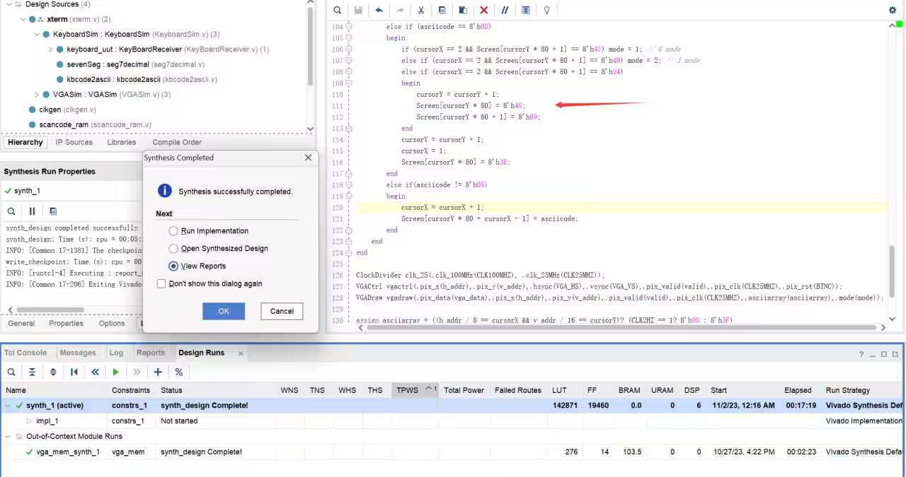

老师您好，我这边 VGA 实验遇到了一个问题，在完成 Text 功能的时候（如下面注释的 Text Function 部分），我使用了 if 进行判断，若发现输入了 T 并按下了回车那么就对 Screen 进行赋值（[7:0]Screen[2399:0] 存储的是640 * 480 里面 2400 个字符点阵对应的字符）。我所需要问的问题是：当我加入了下面这几行对 Screen 的赋值之后（功能是输入 T 后输出 "Hello"），综合使用的 LUT 资源会达到 14万个，直接超出了限定的资源数目。但是当注释掉这个模块中 Screen 的赋值之后， LUT仅仅使用了不到一万个。（我不能理解为什么加入这几行的赋值后就增加了十三万的LUT）
```verilog
    else if (cursorX == 2 && Screen[cursorY * 80 + 1] == 8'h54) // TEXT FUNCTION
    begin
        cursorY <= cursorY + 1;
        Screen[cursorY * 80] = 8'h48;        // cout << Hello
        Screen[cursorY * 80 + 1] = 8'h65;
        Screen[cursorY * 80 + 2] = 8'h6C;
        Screen[cursorY * 80 + 3] = 8'h6C;
        Screen[cursorY * 80 + 4] = 8'h6F;
        Screen[cursorY * 80 + 5] = 8'h21;
```

前者耗时17分钟综合 14万LUT 后者 30秒综合 两千LUT



并且综合出 14 w LUT 的Warning Message 如下


```verilog
module VGASim(
    input  CLK100MHZ,        //系统时钟信号
    input  BTNC,           // 复位信号
    output [3:0] VGA_R,    //红色信号值
    output [3:0] VGA_G,    //绿色信号值
    output [3:0] VGA_B,     //蓝色信号值
    output  VGA_HS,         //行同步信号
    output  VGA_VS,          //帧同步信号
    
    input [7:0] asciicode,
    input [7:0] count,
    input ready
 );
wire [11:0] vga_data;
wire valid;
wire [11:0] h_addr;
wire [11:0] v_addr;
wire CLK25MHZ;

reg [7:0] Screen[2399:0];
reg [127:0] ascii [255:0];

reg [10:0] cursorX;
reg [9:0] cursorY;
wire [127:0] asciiarray;
reg [26:0] counter2HZ;
reg CLK2HZ;
reg [1:0] clr_breakcode;
reg [2:0] mode;


integer i;
initial
      begin
      $readmemh("C:\\Users\\lizheng\\Desktop\\VivadoLab\\LAB6\\lab6\\ASCout.txt", ascii, 0, 255);
      cursorX = 1;
      cursorY = 2;
      mode = 0;

      clr_breakcode = 0;
      for (i = 80; i <= 2399; i = i + 1) Screen[i] = 8'h00;
      for (i = 0; i < 80; i = i + 1) Screen[i] = 8'h2D;
      Screen[8] = 8'h58;
      Screen[9] = 8'h74;
      Screen[10] = 8'h65;
      Screen[11] = 8'h72;
      Screen[12] = 8'h6D;
      Screen[13] = 8'h69;
      Screen[14] = 8'h6E;
      Screen[15] = 8'h61;
      Screen[16] = 8'h6C;
      Screen[50] = 8'h32; Screen[51] = 8'h32; Screen[52] = 8'h31; Screen[53] = 8'h32; Screen[54] = 8'h34;
      Screen[55] = 8'h30; Screen[56] = 8'h30; Screen[57] = 8'h39; Screen[58] = 8'h33; 
      Screen[63] = 8'h43; Screen[64] = 8'h68; Screen[65] = 8'h65; Screen[66] = 8'h6E; Screen[67] = 8'h00;
      Screen[68] = 8'h4C; Screen[69] = 8'h69; Screen[70] = 8'h00;
      Screen[71] = 8'h7A; Screen[72] = 8'h68; Screen[73] = 8'h65; Screen[74] = 8'h6E; Screen[75] = 8'h67;
      Screen[160] = 8'h3E;
end

always @ (posedge CLK100MHZ)
begin
      if (counter2HZ == 25000000) begin
          counter2HZ <= 0;
          CLK2HZ <= ~CLK2HZ;
      end else begin
          counter2HZ <= counter2HZ + 1;
      end
end


// 问题在这个 always 中
// cursorX cursorY 分别代表光标的坐标
always @ (negedge ready) // 当数据输入完成
begin
    if (clr_breakcode == 2) clr_breakcode = 0;
    else clr_breakcode = clr_breakcode + 1;
    if(clr_breakcode == 1) // 忽略数据的断码
    begin
        if (asciicode == 8'h1B && mode != 0)
        begin 
            mode = 0; // 正常输入模式
        end
        else if(asciicode == 8'h08 && cursorX >= 2)
        begin
            cursorX = cursorX - 1;
            Screen[cursorY * 80 + cursorX + 1] = 8'h00;
        end
        else if (asciicode == 8'h0D)
        begin
            if (cursorX == 2 && Screen[cursorY * 80 + 1] == 8'h47) mode = 1; // G mode 
            else if (cursorX == 2 && Screen[cursorY * 80 + 1] == 8'h49) mode = 2; // I mode 
            
            else if (cursorX == 2 && Screen[cursorY * 80 + 1] == 8'h54) // TEXT FUNCTION
            begin
                cursorY <= cursorY + 1;
                Screen[cursorY * 80] = 8'h48;        // cout << Hello
                Screen[cursorY * 80 + 1] = 8'h65;
                Screen[cursorY * 80 + 2] = 8'h6C;
                Screen[cursorY * 80 + 3] = 8'h6C;
                Screen[cursorY * 80 + 4] = 8'h6F;
                Screen[cursorY * 80 + 5] = 8'h21;
            end
            cursorY = cursorY + 1;
            cursorX = 1;
            Screen[cursorY * 80] = 8'h3E;
        end
        else if(asciicode != 8'h08)
        begin
            cursorX = cursorX + 1;
            Screen[cursorY * 80 + cursorX - 1] = asciicode;
        end
    end
end
ClockDivider clk_25(.clk_100MHz(CLK100MHZ), .clk_25MHz(CLK25MHZ));
VGACtrl vgactrl(.pix_x(h_addr),.pix_y(v_addr),.hsync(VGA_HS),.vsync(VGA_VS),.pix_valid(valid),.pix_clk(CLK25MHZ),.pix_rst(BTNC));
VGADraw vgadraw(.pix_data(vga_data),.pix_x(h_addr),.pix_y(v_addr),.pix_valid(valid),.pix_clk(CLK25MHZ),.asciiarray(asciiarray),.mode(mode));

assign asciiarray = ((h_addr / 8 == cursorX && v_addr / 16 == cursorY)? (CLK2HZ == 1? 8'h00 : 8'h5F)
                     : ascii[Screen[v_addr / 16 * 80 + h_addr / 8]]);
assign VGA_R=vga_data[11:8];
assign VGA_G=vga_data[7:4];
assign VGA_B=vga_data[3:0];
endmodule
```