### 姓名：陈力峥  
### 学号：221240093

### 实验内容：流水线 CPU 设计实验
#### 整体方案设计：
实验设计的是五段式流水线 CPU，分别为 IF（取指），ID（指令译码），EX（执行），MEM（访存），WB（写回）五个阶段，并且时钟周期由所有指令耗时最长的阶段决定。流水线 CPU 是在 单周期 CPU 基础上，让各个部件都处理当前对应阶段的指令，使得资源的利用率得到大大提高，并且也缩短了时钟周期。其主要改变在于，需要在各个阶段之间加入流水段寄存器，来存储该指令在当前阶段所需要使用的所有信息，包括PC值，控制信号，寄存器数据，访存数据等等。同时还有一个比较关键的在于需要解决结构冒险（寄存器可能同时需要读、写），控制冒险（跳转指令可能会改变指令顺序，但流水线读取每次是先读取静态 PC， 即 PC + 4），以及数据冒险（在本实验中是 RAW，即还未写回就以及需要进行读取）。以上这些问题需要通过设计转发单元，以及阻塞冲刷信号等等来实现。
#### 顶层模块设计：
1. PipelineCPU_top
   1. PipelineCPU
      1. ForwardUnit（数据转发单元）
      2. IF（即IF阶段所进行的操作）
      3. ID（即ID阶段所进行的操作以及 IF -> ID 流水段寄存器）
         1. CtrSignal（指令对应控制信号生成模块）
         2. InstrImm（立即数生成模块）
         3. Regfiles（寄存器堆）
      4. EX（即EX阶段所进行的操作以及 ID -> EX 流水段寄存器）
         1. ALU 算术逻辑单元
         2. NextAddr（跳转地址计算模块）
            1. JumpCtr（跳转信号生成模块）
      5. MEM（即MEM阶段所进行的操作以及 EX -> MEM 流水段寄存器）
      6. WB（即WB阶段所进行的操作以及 MEM -> WB 流水段寄存器）
   2. testmem(Instruction Memory)
   3. testdmem(Data Memory)
   4. seg7todecimal(数码管模块)
#### 描述与定义：
下面为上述各个端口的定义
```verilog
module PipelineCPU_top(
    input CLK100MHZ,
    input [11:0] a,
    input reset,
    output [6:0] seg,
    output [7:0] an,
    output [15:0] a_out                                                                                
);
```

```verilog
module rv32ip(
    input 	clk,
	input 	rst,
	output [31:0] imemaddr,		//imem的地址
	input  [31:0] imemdataout,	//imem读取到的数据
	output 	imemclk,			//imem的时钟
	output [31:0] dmemaddr,		//dmem的地址
	input  [31:0] dmemdataout,	//dmem读取到的数据
	output [31:0] dmemdatain,	//需要写入dmem的数据
	output 	dmemrdclk,			//dmem读口时钟
	output	dmemwrclk,			//dmem写口时钟
	output [2:0] dmemop,		//3'b000:sb 3'b001:sh 3'b010://sw
	output	dmemwe,				//dmem写有效
	output [31:0] dbg_data,	    //当前完成的指令的PC
	output done,				//读取到Instr为0xdead10cc时认为程序结束
	output wb,					//当前周期是否有指令完成
	
	input [31:0] a,
	
	output [31:0] reg00, reg01, reg02, reg03, reg04, reg05, reg06, reg07,
				  reg08, reg09, reg10, reg11, reg12, reg13, reg14, reg15,
				  reg16, reg17, reg18, reg19, reg20, reg21, reg22, reg23,
				  reg24, reg25, reg26, reg27, reg28, reg29, reg30, reg31
);
```

```verilog
module ForwardUnit(
    // input clk, rst,
    input [4: 0]EX_rs1,
    input [4: 0]EX_rs2,
    input [4: 0]WB_rd,
    input [4: 0]M_rd,
    input WB_RegWr,
    input WB_MemtoReg,
    input M_RegWr,
    input M_MemtoReg,
    
    input [31:0]WB_Memout,
    input [31:0]WB_ALUResult,
    input [31:0]M_ALUResult,
    input [31:0]M_Memout,
    
    
    output reg Forwardrs1, Forwardrs2,
    output reg [31:0]ForwardData1, ForwardData2,
    output reg stallIF,
    output reg stallID,
    output reg stallEX,
    output reg flushEX
    );    
```

```verilog
module IF(
    input clk, rst, flush, block,
    input [31:0] inputPC,
    input done,
    output [31:0] imemaddr,
    output imemclk,
    input [31:0] imemdataout,

    output [31:0] currentPC,
    output [31:0] snPC,
    output [31:0] currentInstr
);
```

```verilog
module ID(
    input clk, flush, block, rst,
    input [31:0] in_instr,
    input [31:0] in_PC,
    input in_RegWr,
    input [31:0] in_busw,
    input [4:0] in_rw,
    
    input [31:0] a,

    output [4:0] rs1,
    output [4:0] rs2,
    output [31:0] currentPC,
    output [31:0] imm,
    output [2:0] Branch,
    output [1:0] ALUBSrc,
    output [3:0] ALUctr,
    output [2:0] MemOp,
    output RegWr, MemtoReg, ALUASrc, MemWr,
    output [31:0] busa, busb,
    output [4:0] rw,
    //output blk,
    output done,

    output [31:0] reg00,
    output [31:0] reg01,
    output [31:0] reg02,
    output [31:0] reg03,
    output [31:0] reg04,
    output [31:0] reg05,
    output [31:0] reg06,
    output [31:0] reg07,
    output [31:0] reg08,
    output [31:0] reg09,
    output [31:0] reg10,
    output [31:0] reg11,
    output [31:0] reg12,
    output [31:0] reg13,
    output [31:0] reg14,
    output [31:0] reg15,
    output [31:0] reg16,
    output [31:0] reg17,
    output [31:0] reg18,
    output [31:0] reg19,
    output [31:0] reg20,
    output [31:0] reg21,
    output [31:0] reg22,
    output [31:0] reg23,
    output [31:0] reg24,
    output [31:0] reg25,
    output [31:0] reg26,
    output [31:0] reg27,
    output [31:0] reg28,
    output [31:0] reg29,
    output [31:0] reg30,
    output [31:0] reg31
);
```

```verilog
module EX (
    input clk, flush, block, rst,
    input [31:0] in_busa, in_busb,
    input [4:0] in_rw,
    input [31:0] in_PC,
    input [31:0] in_imm,
    input [2:0] in_Branch,
    input [1:0] in_ALUBSrc,
    input [3:0] in_ALUctr,
    input [2:0] in_MemOp,
    input in_RegWr, in_MemtoReg, in_ALUASrc, in_MemWr,
    input in_done,

    output PCselect,
    output [31:0] result,
    output [31:0] currentPC,
    output [31:0] busb,
    output [4:0] rw,
    output [2:0] MemOp,
    output RegWr, MemtoReg, MemWr,
    output done,
    output flush_o,
    output [2:0] Branch,
    output [31:0] nextPC
);
```

```verilog
module M(
    input clk,
    input rst,
    
    input MemWr,
    input [2:0] MemOp,

    input done, 
    input [31:0] Di,
    input [31:0] ALUout,
    input [31:0] currentPC,

    input MemtoReg,
    input RegWr,
    input [4:0] Rd,
   
    output reg MemtoReg_o,
    output reg RegWr_o,
    output reg [4:0] Rd_o,
    output reg [31:0] ALUout_o,
    output reg done_o,
    output reg [31:0] PC_o,

	output [31:0] dmemaddr,
	input [31:0] dmemdataout,
	output [31:0] dmemdatain,
	output dmemrdclk,
	output dmemwrclk,
	output [2:0] dmemop,
	output dmemwe,
    
    output [31:0] Do
);
```

```verilog
module WB(
    input clk, rst, flush,
    input MemtoReg,
    input RegWr,
    input done,
    input [4:0] Rd,
    input [31:0] Do,
    input [31:0] ALUout,
    input [31:0] currentPC,
    output reg [31:0] Di,
    output reg WE,
    output reg [4:0] Rw,
    output reg wb,
    output reg done_o,
    output reg [31:0] PC_o
);
```

```verilog
module testmem(
	address,
	clock,
	data,
	wren,
	q);

	input	[15:0]  address;
	input	  clock;
	input	[31:0]  data;
	input	  wren;
	output reg	[31:0]  q;
	
	reg [31:0] ram [65535:0];
```

```verilog
module dmem(addr, dataout,  datain, rdclk, wrclk, memop, we);
	input  [31:0] addr;
	output reg [31:0] dataout;
	input  [31:0] datain;
	input  rdclk;
	input  wrclk;
	input [2:0] memop;
	input we;
	
	wire [31:0] memin;
	reg  [3:0] wmask;
	wire [7:0] byteout;
	wire [15:0] wordout;
	wire [31:0] dwordout;
```
#### 实验原理图：
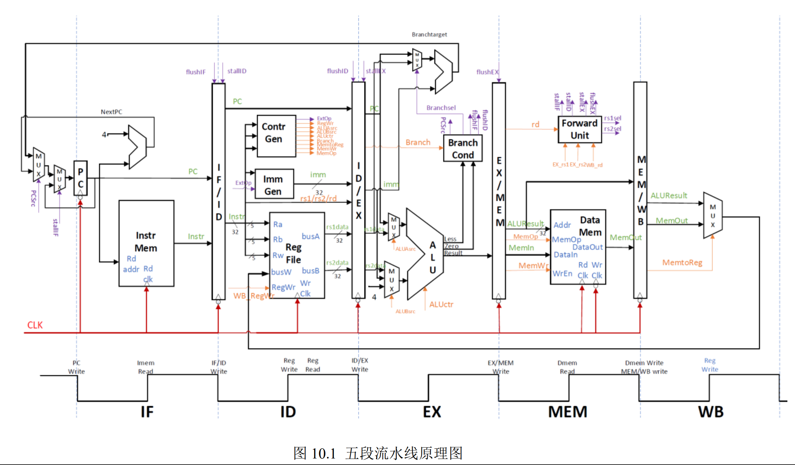
#### 关键的设计语句/源代码
比较关键的是新加入的数据转发模块：
其中还包含了阻塞信号的生成以及 flushEX 信号的生成，并且处理了 M -> EX, WB -> EX 的数据冒险。
```verilog
module ForwardUnit(
    // input clk, rst,
    input [4: 0]EX_rs1,
    input [4: 0]EX_rs2,
    input [4: 0]WB_rd,
    input [4: 0]M_rd,
    input WB_RegWr,
    input WB_MemtoReg,
    input M_RegWr,
    input M_MemtoReg,
    
    input [31:0]WB_Memout,
    input [31:0]WB_ALUResult,
    input [31:0]M_ALUResult,
    input [31:0]M_Memout,
    
    
    output reg Forwardrs1, Forwardrs2,
    output reg [31:0]ForwardData1, ForwardData2,
    output reg stallIF,
    output reg stallID,
    output reg stallEX,
    output reg flushEX
    );    

always @ (*) begin
    if (M_MemtoReg && M_rd != 5'b00000 && (EX_rs1 == M_rd || EX_rs2 == M_rd)) begin stallIF = 1; stallID = 1; stallEX = 1; flushEX = 1; end
    else begin stallIF = 0; stallID = 0; stallEX = 0; flushEX = 0; end
    
    ForwardData1 = 32'h00000000;
    ForwardData2 = 32'h00000000;
    Forwardrs1 = 0;
    Forwardrs2 = 0;
    if(WB_RegWr && WB_rd != 5'b00000 && (EX_rs1 == WB_rd || EX_rs2 == WB_rd)) begin
        if(EX_rs1 == WB_rd) begin ForwardData1 =(WB_MemtoReg == 1 ? WB_Memout : WB_ALUResult); Forwardrs1 = 1; end 
        if(EX_rs2 == WB_rd) begin ForwardData2 =(WB_MemtoReg == 1 ? WB_Memout : WB_ALUResult); Forwardrs2 = 1; end
    end
    if(M_RegWr && M_rd != 5'b00000 && (EX_rs1 == M_rd || EX_rs2 == M_rd)) begin
        if(EX_rs1 == M_rd) begin ForwardData1 = (M_MemtoReg == 1 ? M_Memout : M_ALUResult); Forwardrs1 = 1; end 
        if(EX_rs2 == M_rd) begin ForwardData2 = (M_MemtoReg == 1 ? M_Memout : M_ALUResult); Forwardrs2 = 1; end
    end
end 
endmodule
```

还有一个比较关键的是流水线寄存器在模块内的定义：
这里以 ID -> EX 流水段寄存器为例，当时钟下降沿到来的时候才会更新流水段寄存器，使得可以进行下一指令的 EX 阶段操作
```verilog
    always @(negedge clk) begin
        if (rst) begin
            reg_PC          <= 32'h00000000;
            reg_imm         <= 32'h00000000;
            reg_busa        <= 32'h00000000;
            reg_busb        <= 32'h00000000;
            reg_rw          <= 5'b00000;
            reg_Branch      <= 3'b000;
            reg_ALUBSrc     <= 2'b00;
            reg_ALUctr      <= 4'b0000;
            reg_MemOp       <= 3'b000;
            reg_RegWr       <= 1'b0;
            reg_MemtoReg    <= 1'b0;
            reg_ALUASrc     <= 1'b0;
            reg_MemWr       <= 1'b0;
            reg_done        <= 1'b0;      
        end
        else if (!block) begin
            reg_PC          <= in_PC;
            reg_imm         <= in_imm;
            reg_busa        <= in_busa;
            reg_busb        <= in_busb;
            reg_rw          <= in_rw;
            reg_Branch      <= in_Branch;
            reg_ALUBSrc     <= in_ALUBSrc;
            reg_ALUctr      <= in_ALUctr;
            reg_MemOp       <= in_MemOp;
            reg_RegWr       <= in_RegWr;
            reg_MemtoReg    <= in_MemtoReg;
            reg_ALUASrc     <= in_ALUASrc;
            reg_MemWr       <= in_MemWr;
            reg_done        <= in_done;
            end
        else if(flush) begin
            reg_PC          <= 32'h00000000;
            reg_imm         <= 32'h00000000;
            reg_busa        <= 32'h00000000;
            reg_busb        <= 32'h00000000;
            reg_rw          <= 5'b00000;
            reg_Branch      <= 3'b000;
            reg_ALUBSrc     <= 2'b00;
            reg_ALUctr      <= 4'b0000;
            reg_MemOp       <= 3'b000;
            reg_RegWr       <= 1'b0;
            reg_MemtoReg    <= 1'b0;
            reg_ALUASrc     <= 1'b0;
            reg_MemWr       <= 1'b0;
            reg_done        <= 1'b0;        
            end
    end
```
#### 实验数据仿真测试波形图
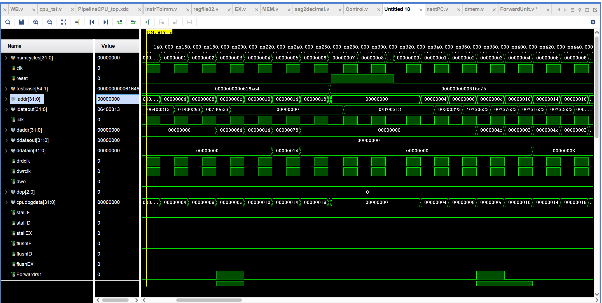
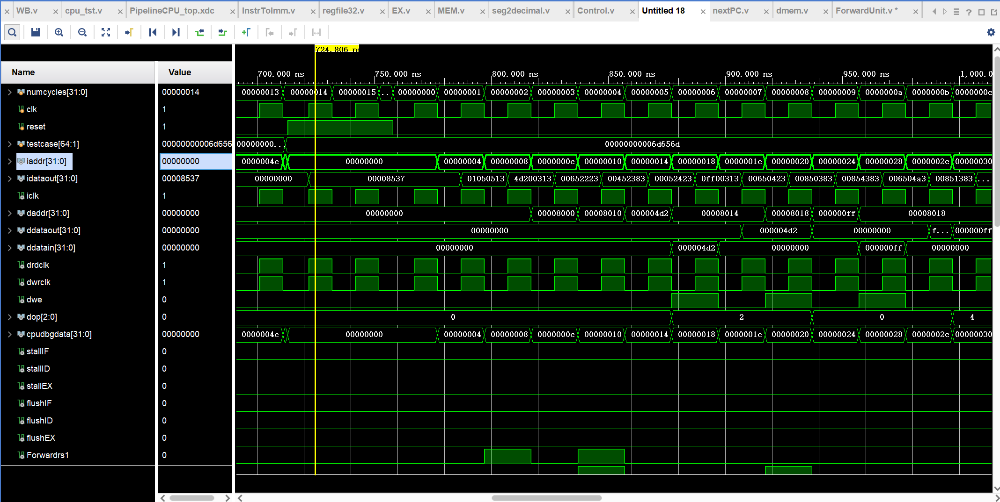
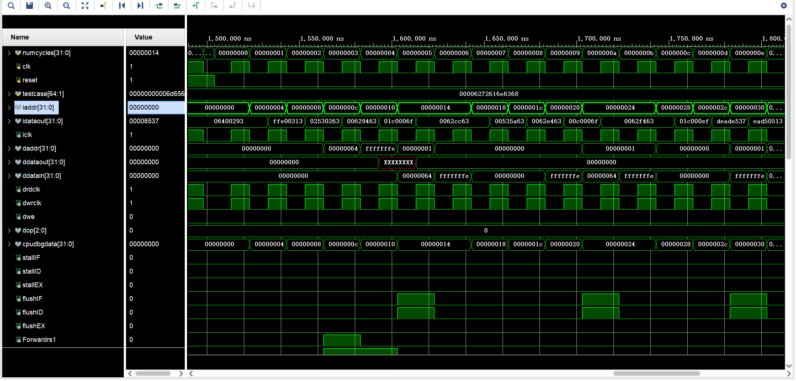
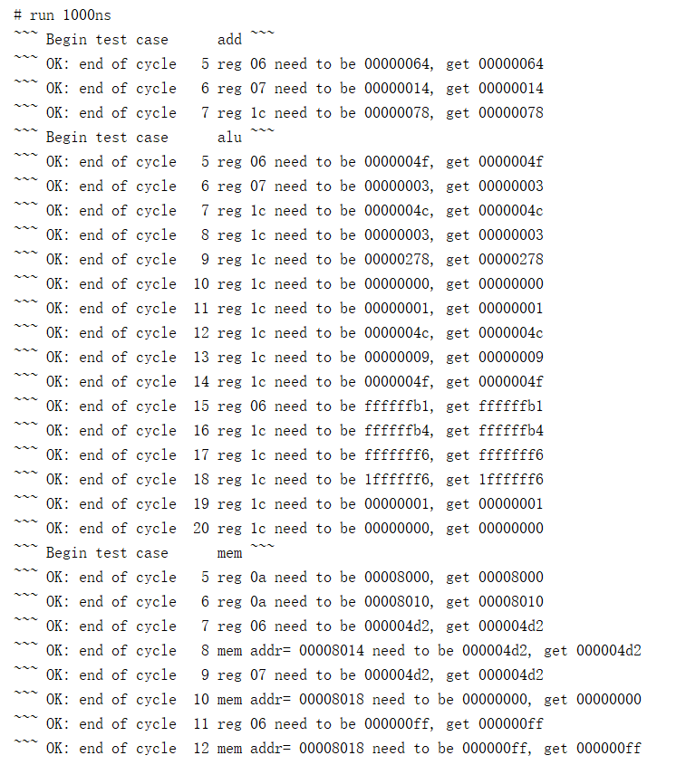
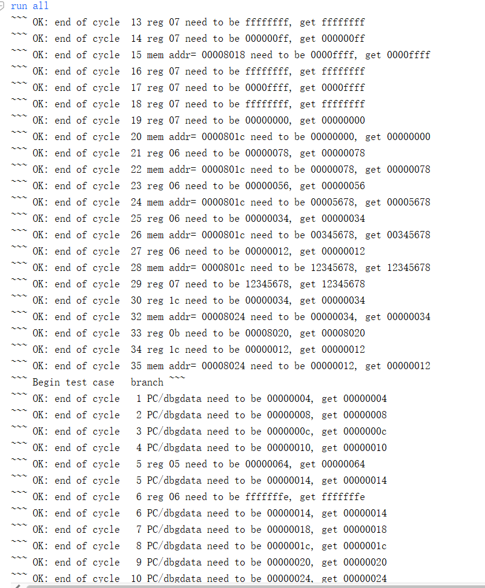
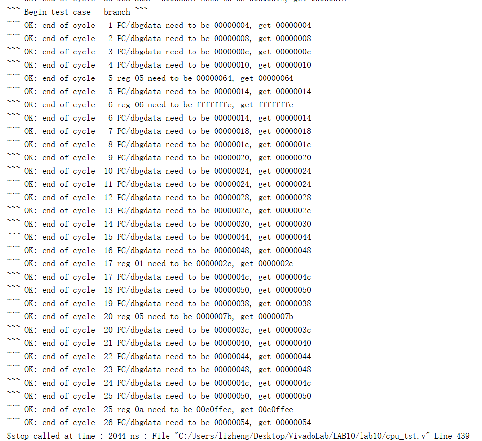
#### 开发板验证
进行验证的是累加和程序：分别输入 6 以及 100（十六进制为 64H），得到结果 15H（十进制为 21） 以及 13baH(十进制为 5050)
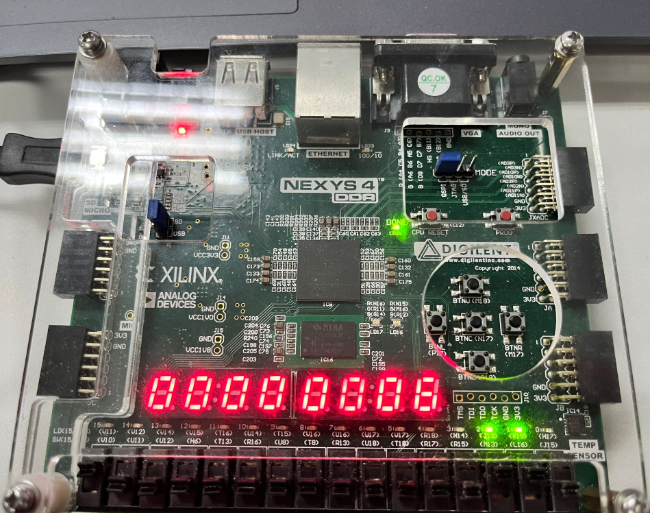
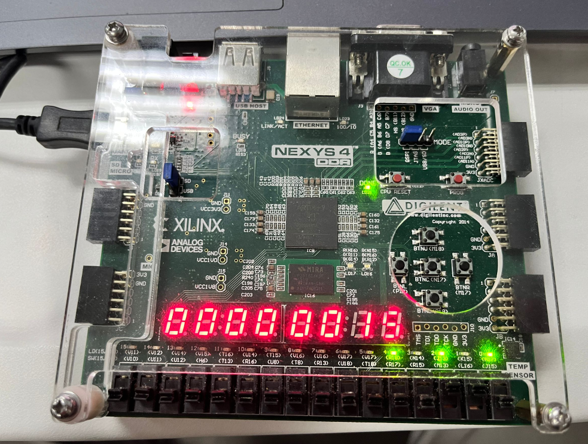
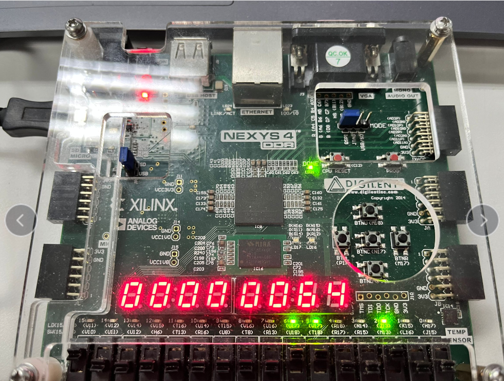
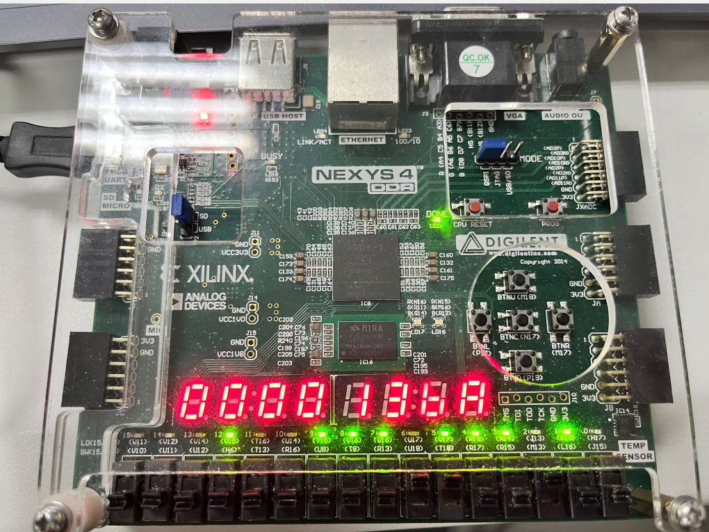
#### 错误现象及分析
在对流水段寄存器进行冲刷、阻塞还是正常写入的选择中，采用了 if-else if的写法，并且先进行判断了冲刷。事实上应该先对是否阻塞进行判断。

以及对于 flushID flushIF 信号的生成，其实只需要根据 PCselect 信号来生成即可，即若 PCselect 选择了跳转的 PC 地址，那么就需要进行冲刷，使得 flushID flushIF 为 1，否则为 0. 在实验中，对于冲刷信号的生成写成了```flush = (Branch != 3'b000 && EX_nextPC != EX_PC + 4)```来判断是否跳转，事实上这是不对的，在实际运行过程中，恰好可能跳转地址就是 ```EX_PC + 4```，此时会因为没有进行冲刷而使得执行了错误的指令。
### 思考题一：
增加一个中断控制器（Interrupt Controller）模块以及 CSR 寄存器堆模块，用于处理中断以及存储中断时的上下文内容及数据等等。
可以在流水线的 ID 阶段进行判断是否需要进行中断，若中断，则需要该改变 PC 并且存储此时的上下文，跳转到中断处理模块处的入口地址继续执行。
当中断处理程序完成后，判断是否需要恢复之前的上下文，并且继续执行被中断的指令。
### 思考题二：
高级流水线利用指令级并行来提高 CPU 性能，一种是超流水线，通过增加流水线级数来使得更多的指令可以重叠执行，使得其指令吞吐率变高，但是这也会使得分支预测若是预测错误，其代价也会变得更高一些。还有一种是多发射流水线，也就是通过同时启动多条指令，独立运行来提高指令的并行性，其 CPI 能够达到小于 1 的水平。
### 思考题三：
要设计更多流水段的CPU，可以考虑将指令执行过程进一步细分为更多的独立阶段，以实现更细粒度的指令级并行和流水线处理。
五段流水线阶段包括取指令、译码、执行、访存和写回。例如其中的执行阶段可以再细分为 ALU 计算单元，跳转地址计算等阶段。
在加入额外的阶段之后还需要再加入额外的流水线寄存器：在每个新的流水线阶段之间插入寄存器，存储指令流经不同阶段的中间结果。
并且在更多的流水线阶段中，可能会出现更复杂的数据依赖关系。为了处理这些依赖关系，需要使用技术如数据前推、冲突检测和解决等。