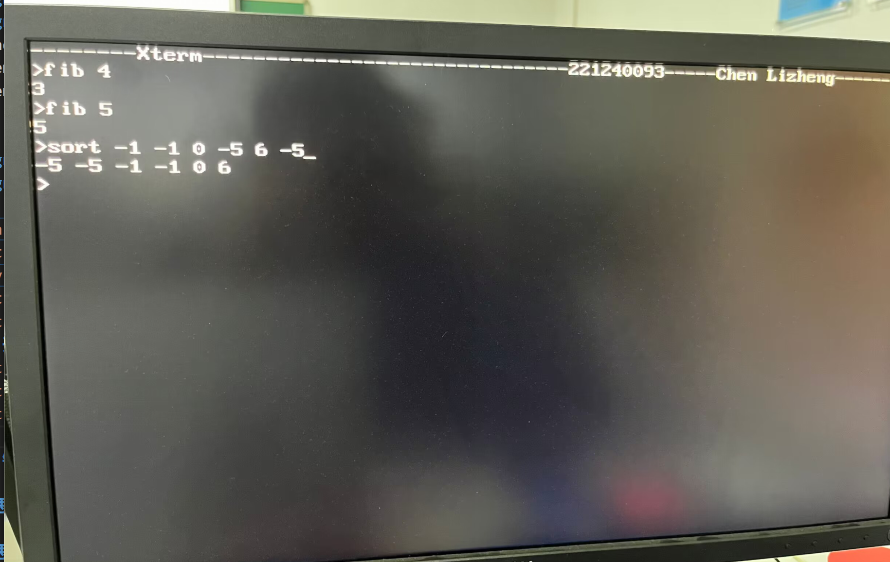

#### 姓名：陈力峥  
#### 学号：221240093

### 计算机系统实验
#### 整体方案设计：
计算机系统实验整体分为硬件和软件两个部分，硬件需要在同一个内存空间中将 LED， 七段数码管， VGA， 键盘等等组合起来，这需要用到外设内存映射的方法。通过高 $12$ 来识别当前内存空间属于哪一外设。由此来选择数据是从哪一个外设进行读取（这样巧妙地避开了设置多个外设接口的做法，最后将 CPU， VGA， 键盘， 存储器， 数码管等等组合为顶层模块 $xterm$ 即可。其中还需要编写其中的软件部分，需要注意的是，软件部分所使用的内存范围应该与硬件设定的范围一致，具体是需要设置好 VGA_START, KEY_START, KEY_HEAD, KEY_TAIL 等等宏定义的内存地址，并且通过内联汇编设置好栈的地址，使得内存读写的范围得到确定。软件部分具体需要设置键盘的缓冲区，设置 VGA 的识别模式和各个算法（fib，sort 等），并且需要输出的数据写在对应的内存位置。
#### 顶层模块设计：
$xterm$
1. divider25MHZ
2. KeyboardSim
   1. kbcode2ascii
   2. KeyBoardReceiver
3. VGASim
   1. VGACtrl
   2. VGADraw
4. rv32ip_cpu
   1. ...
5. InstrMem
6. DataMem
7. seg7decimal
#### 描述与定义：
xterm
```verilog
module xterm(
    input CLK100MHZ,   //系统时钟信号
    input PS2_CLK,    //来自键盘的时钟信号
    input PS2_DATA,  //来自键盘的串行数据位
    input BTNC,      //Reset
    input reset,
    output [6:0]SEG,
    output [7:0]AN,     //显示扫描码和ASCII码
    //output [15:0] LED,   //显示键盘状态
    output [3:0] VGA_R,
    output [3:0] VGA_G,
    output [3:0] VGA_B,
    output  VGA_HS,
    output  VGA_VS
);
```
Keyboard
```verilog
module KeyboardSim(
    input CLK100MHZ,   //系统时钟信号
    input PS2_CLK,    //来自键盘的时钟信号
    input PS2_DATA,  //来自键盘的串行数据位
    input BTNC,      //Reset
   // output reg breakcode,
    output wire ready,
    output reg [31:0]keymemout,
    input [31:0]kbdatain,
    input dwrclk,
    input reset,
    input [31:0]kbaddr,
    input we
   // output wire [7:0] ascii
    );
```
VGA
```verilog
module VGASim(
    input CLK25MHZ,        //系统时钟信号
    input  BTNC,           // 复位信号
    output [3:0] VGA_R,    //红色信号值
    output [3:0] VGA_G,    //绿色信号值
    output [3:0] VGA_B,     //蓝色信号值
    output  VGA_HS,         //行同步信号
    output  VGA_VS,          //帧同步信号
    output wire [11:0] h_addr,
    output wire [11:0] v_addr,
    input [7:0] asciiin
 );
```
其余具体定义以及 CPU、存储器的定义在前面已经具体给过。

#### 关键的设计语句/源代码
设备的写使能需要根据内存地址的高十二位确定
```verilog
wire[31:0] keymemout;
wire [31:0] daddr;wire we;wire [31:0] ddatain;
wire kbwe, dwrclk;
assign kbwe = (daddr[31:20] == 12'h003) ? dwe : 0;
KeyboardSim kbsim(.CLK100MHZ(CLK100MHZ),.PS2_CLK(PS2_CLK),.PS2_DATA(PS2_DATA),.BTNC(BTNC)
    ,.ready(ready)
    ,.keymemout(keymemout)
    ,.kbdatain(ddatain)
    ,.dwrclk(dwrclk)
    ,.reset(reset)
    ,.kbaddr(daddr)
    ,.we(kbwe)
);
```
```verilog
wire [31:0] vgamemout;
assign datawe = (daddr[31:20] == 12'h001) ? dwe : 1'b0;    
assign vgamemout = screen[lin][col];
assign dataout = (daddr[31:20]==12'h001)? ddataout : ((daddr[31:20] == 12'h003)? keymemout : ((daddr[31:20] == 12'h002) ? vgamemout : 32'b0));

wire [6:0] lin, col;
assign lin = (daddr >> 7) & 7'h7f;
assign col = daddr & 7'h7f;
```
```main.c```

```sys.c```


#### 开发板验证
将开发板连接上屏幕验证：



#### 错误现象及分析
错误主要发生在难以处理好软硬件的接口部分，以及内存数据的访问等等，在编写的时候很容易访问错误导致不是很能理解的错误。
### 思考题一：
运行流行的 ```BenchMark``` 对 CPU 性能进行评估
采用的是群里发布的测试程序，其中还包括了数据冒险，分支预测等测试
具体结果如下：

### 思考题二：
主要需要在原有的CPU设计中，需要添加与Cache模块之间的连接接口从而实现数据之间的读写。并且 Cache 的读写策略、替换策略、Cache 与 存储器一致性等各个方面同时也需要与数据存储器、指令存储器添加入接口进行块的读写即可。
### 思考题三：
DDR其实就是具有双倍数据传输率的SDRAM，在DRAM的基础上快上加快。DDR在每一个时钟周期内可以传输两次数据，利用 DDR 移植一个简单的操作系统，首先应该确认CPU和DDR之间的接口类型。根据DDR接口同时也应该修改系统中的内存控制器模块的读写操作等。
而在设计操作系统时，还需要考虑内存映射方案。确定操作系统在DDR中的加载地址范围，并将其映射到CPU的地址空间中。
最后根据目标操作系统的要求和架构，进行相应的移植工作。需要将操作系统的代码和内核加载到DDR中，并设置正确的启动参数。还需要调整操作系统的驱动程序和底层代码，以适配DDR接口和内存控制器。