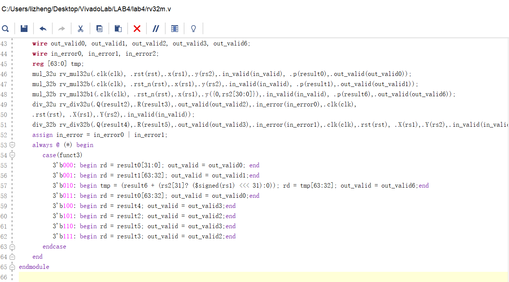

### 姓名：陈力峥  
### 学号：221240093

### 实验内容
### 实验一：补码一位乘法器实验
#### 整体方案设计：
利用行为建模来模拟 Booth 算法的过程，每一次计算根据$Y_iY_{i-1}$的数值来决定下一次的运算，为 00 或 11 时不操作，01时部分积加被乘数X， 10时部分积减被乘数X。重复 n 次后得到运算结果。
#### 顶层模块设计：
1. 部分积生成逻辑
2. 控制逻辑计数器逻辑
#### 描述与定义：
1. 输入端口
   1. clk 时钟信号
   2. rst_n 重置信号
   3. 三十二位 x 表示被乘数
   4. 三十二位 y 表示乘数
   5. 1 位 in_valid 高电平时表示乘法器开始运作
2. 输出端口
   1. 1 位 out_valid 表示当前输出有效
   2. 64 位输出 p 表示乘积结果 
#### 实验原理图：

#### 关键的设计语句/源代码
控制逻辑计数器部分
```verilog
 always @(posedge clk or posedge rst_n) begin
     if (rst_n) cn <= 0;
     else if (in_valid) cn <= 33;
     else if (cn != 0) cn <= cn - 1;
 end
```
部分积生成逻辑
```verilog
always @(posedge clk or posedge rst_n) 
    // 生成每次用于计算的操作数 b 以及判断是加法还是减法
    if (cn >= 33) begin
        if (y[0]) begin
            numberb <= rx;
            sub <= 1;
        end
        else begin numberb <= 0; sub <= 0; end
    end else begin
        case (ry[1:0])
            2'b01: begin
                numberb <= rx;
                sub <= 0;
            end
            2'b10: begin
                numberb <= rx;
                sub <= 1;
            end
            default: begin numberb <= 0; sub <= 0; end 
        endcase
    end
    // 载入数据
        if (rst_n) begin
            {rp, ry, rx} <= 0;
        end else if (in_valid) begin
            {rp, ry, rx} <= {32'b0, y, x};
        end else if (cn <= 32 && cn >= 1) begin
            {rp, ry} <= $signed({Add_result, ry}) >>> 1;
        end
    end
```
#### 实验数据仿真测试波形图
下面为仿真实验测试结果，输出两个在 out_valid = 1的情况下的运算结果并且没有 error 出现


#### 综合设计图
综合设计结果


#### 开发板验证
开发板验证均将于最后一个实验中共同验证
#### 
对于 always 模块应该以 clk 以及 rst_n 为变量，最初错误地写为了 always@(*)
```verilog
always @(posedge clk or posedge rst_n) begin
```
对于算术移位需要对有符号数进行操作
```verilog
 {rp, ry} <= $signed({Add_result, ry}) >>> 1;
 ```
 并且按照上面的逻辑来实现的话，需要将 cn 初值赋为 33，第一个周期进行载入，此后三十二个周期才是进行运算。
### 实验二：快速乘法器
#### 整体方案设计：
快速乘法器依赖于加法器阵列来实现。而加法阵列基于 CSA（Carry Save Adder，进位保留加法器）方式的结构。CSA 将本级进位与本级和一样同时输出至下一级，而不是向前传递到本级的下一位，且向下级传递的速度与字长无关。将每一行的数值进行组合后向下累加即可。
#### 顶层模块设计：
加法器阵列模块
#### 描述与定义：
1. 输入端口
   1. 三十二位输入 X 表示被乘数
   2. 三十二位输入 Y 表示乘数
2. 输出端口
   三十二位输出 P 表示乘积
#### 实验原理图：

#### 关键的设计语句/源代码
主要是需要生成每一行的乘积分量
```verilog
// 生成每行的乘积分量
  for (i = 0; i < 32; i = i + 1) begin
      for (j = 31; j >= 0; j = j - 1) begin
        if (j > 0) begin
          row_sum[i] = ((row_sum[i] + ((X[j] & Y[i]) | (X[j] & cout[j]) | Y[i] & cout[j])) << 1);  
          cout[j] = ((X[j] & Y[i]) | (X[j] & cout[j]) | (Y[i] & cout[j]));
           end
        else begin
          row_sum[i] = ((row_sum[i] + (X[j] & Y[i])) << j);  
          cout[0] = (X[j] & Y[i]); end
      end
   end
```
#### 实验数据仿真测试波形图


#### 错误现象及分析
```verilog
for (j = 31; j >= 0; j = j - 1)
```
在写出这样的循环的时候，需要注意 j 如果为无符号数，那么这将会成为一个死循环，因为 j 为零再减一并不是负一
### 实验三：补码除法器
#### 整体方案设计：
采用不恢复余数法来实现补码的除法器，其中若是两个 n 位的操作数进行相除，需要将被除数符号拓展到 2n 位。然后在通过行为建模来模拟算法的进行。
#### 顶层模块设计：
1. 除法运算计数器逻辑
2. 生成中间余数和商
#### 描述与定义：
1. 输入端口
   1. 时钟信号 clk
   2. 重置信号 rst
   3. 32位有符号的被除数 X 与 除数 Y
   4. 1位信号in_valid 高电平表示数据就绪开始除法运算
2. 输出端口
   1. in_error被除数或除数为 0 时为高电平
   2. out_valid 表示除法运算结束时输出1
   3. 32位有符号输出 Q 为商
   4. 32位有符号输出 R 为余数
#### 关键的设计语句/源代码
计数器逻辑
```verilog
 always @(posedge clk or posedge rst) begin
     if (rst) cn <= 0; 
     else if (in_valid) cn <= 32;
     else if (cn != 0) cn <= cn - 1;
 end
 ```
 中间余数与商生成逻辑
 ```verilog
      if (rst) begin TempQ = 0; RDIV = 0; end
     else if (in_valid) begin 
        RDIV = {{32{X[31]}},X};
        TempQ = 32'b0; 
        temp_out_valid = 1'b0;
        if (X[31] == Y[31]) RDIV[63:32] = RDIV[63:32] - Y;
        else RDIV[63:32] = RDIV[63:32] + Y;
        TempQ[32] = (RDIV[63] == Y[31] ? 1:0); 
        end
     else if ((cn >= 0)&&(!out_valid)) begin
         if(cn > 0) begin
            TempQ[cn - 1] = (RDIV[63] == Y[31]?1:0);
            RDIV[63:32] = diff_result;
            RDIV[31:0] = {RDIV[30:0], 1'b0};
         end
         else if (cn == 0) begin
            temp_out_valid = 1'b1;
            TempQ[32:1] = TempQ[31:0];
            TempQ[0] = (sub == 1'b1)? 1 : 0;
            if(X[31] != Y[31]) TempQ = TempQ + 1;
            if(RDIV[63] != X[31])begin
                if(X[31] == Y[31]) RDIV[63:32] = RDIV[63:32] + Y;
                else RDIV[63:32] = RDIV[63:32] - Y;
            end
         end
     end
 ```
#### 实验数据仿真测试波形图


#### 错误现象及分析
错误现象主要是算法实现逻辑的细节有部分问题。
如在最后处理的时候遗漏的左移操作
```verilog
    TempQ[32:1] = TempQ[31:0];
    TempQ[0] = (sub == 1'b1)? 1 : 0;
```
### 实验四：RV32M指令实现
#### 整体方案设计：
运用前面实验得到的模块以及提供的无符号乘法无符号除法运算模块来实现部分有关乘除法的 RV32M指令。其中还需要一个RV32M_TOP模块来定义合适的输入输出以便于在开发板上进行验证
#### 顶层模块设计：
1. 无符号乘法模块
2. 有符号乘法模块
3. 无符号除法模块
4. 有符号除法模块
5. RV32M_TOP模块
#### 描述与定义：
1. rv32m模块
   1. 输入端口:
      1. 时钟信号 clk
      2. 重置信号 rst
      3. 有效输入信号 in_valid
      4. 32位寄存器操作数 rs1 rs2
      5. 3位功能选择码 funct3
   2. 输出端口
      1. in_error 表示运算是否出错
      2. out_valid 运算结束时为高电平
      3. 32位 rd 表示运算结果
2. rv32m_top模块
   1. 输入端口
      1. 时钟信号 clk
      2. 重置信号 rst
      3. 有效输入信号 in_valid
      4. 4位寄存器操作数 rs1 rs2（复制八次后载入rv32m）
      5. 3位功能选择码 funct3
   2. 输出端口
      1. in_error 表示运算是否出错
      2. out_valid 运算结束时为高电平
      3. 16位 rd_l 表示运算结果的低十六位
      4. segs表示数码管七段数值
      5. AN表示选择的数码管编号
#### 实验原理图：
原理即为前面实验的原理图，这里给出功能码对应的指令表格

#### 关键的设计语句/源代码
关键在于各个模块的调用是否正确。其中对于有符号乘无符号的指令需要特别注意，可以通过有符号乘法进行实现，只需要将无符号数的最高先看作是 0 然后进行有符号数相加，若无符号数最高位实际为 1 则加上 rs1 << 31，为 0 则不变。
```verilog
    reg [63:0] tmp;
    mul_32u rv_mul32u(.clk(clk), .rst(rst),.x(rs1),.y(rs2),.in_valid(in_valid), .p(result0),.out_valid(out_valid0));
    mul_32b rv_mul32b(.clk(clk), .rst_n(rst),.x(rs1),.y(rs2),.in_valid(in_valid), .p(result1),.out_valid(out_valid1));
    mul_32b rv_mul32b1(.clk(clk), .rst_n(rst),.x(rs1),.y({0,rs2[30:0]}),.in_valid(in_valid), .p(result6),.out_valid(out_valid6));
    div_32u rv_div32u(.Q(result2),.R(result3),.out_valid(out_valid2),.in_error(in_error0),.clk(clk),
    .rst(rst), .X(rs1),.Y(rs2),.in_valid(in_valid));
    div_32b rv_div32b(.Q(result4),.R(result5),.out_valid(out_valid3),.in_error(in_error1),.clk(clk),.rst(rst), .X(rs1),.Y(rs2),.in_valid(in_valid));
    assign in_error = in_error0 | in_error1;
    always @ (*) begin
       case(funct3) 
          3'b000: begin rd = result0[31:0]; out_valid = out_valid0; end
          3'b001: begin rd = result1[63:32]; out_valid = out_valid1;end
          3'b010: begin tmp = (result6 + (rs2[31]? ($signed(rs1) <<< 31):0)); rd = tmp[63:32]; out_valid = out_valid6;end
          3'b011: begin rd = result0[63:32]; out_valid = out_valid0;end
          3'b100: begin rd = result4; out_valid = out_valid3;end
          3'b101: begin rd = result2; out_valid = out_valid2;end
          3'b110: begin rd = result5; out_valid = out_valid3;end
          3'b111: begin rd = result3; out_valid = out_valid2;end
       endcase
    end
```

rv32m_top 
```verilog
rv32m rv32mtop(.rd(result),.out_valid(out_valid),.in_error(in_error),.clk(clk),.rst(rst),
               .rs1({8{x}}),.rs2({8{y}}),.funct3(funct3),.in_valid(in_valid));
assign rd_l = result[15:0];
```
#### 实验数据仿真
关于rv32m实验的仿真：在没有报错的情况下，同时在 rv32m 模块中正常对 rd 进行了赋值，但在给出的仿真文件仿真测试后 rd 赋值并不会发生变化，均为零，这边暂时没有勘探出问题。但是在后续的开发板测试中，可以看到 rd 是有被正确赋值的并且可以正确输出，见后面的开发板验证。


#### 开发板验证
下图分别为输入rs1 = cccccccc rs2 = 55555555 的情况下按照顺序功能码从 0 到 7 的开发板验证结果
<div style="float:left;border:solid 1px 000;margin:2px;"></div>
<div style="float:left;border:solid 1px 000;margin:2px;"></div>

<div style="float:left;border:solid 1px 000;margin:2px;"></div>
<div style="float:left;border:solid 1px 000;margin:2px;"></div>

<div style="float:left;border:solid 1px 000;margin:2px;"></div>
<div style="float:left;border:solid 1px 000;margin:2px;"></div>

<div style="float:left;border:solid 1px 000;margin:2px;"></div>
<div style="float:left;border:solid 1px 000;margin:2px;"></div>

#### 错误现象及分析
要注意运算的优先级
三目运算外部最好添加括号保证正确，在这里不添加括号得到的结果是不正确的。
```verilog
tmp = (result6 + (rs2[31]? ($signed(rs1) <<< 31):0));
```

### 思考题一：
资源耗费情况如下，相比之前的实验，这次实验的资源消耗大于之前的所有实验。LUT多达八百多个，其中IO端口也占用了 22% 的资源


### 思考题二：
对于浮点数的乘法
1. 先解析浮点数，将其拆分为符号位、指数位和尾数位。
2. 可以使用乘法器电路来执行尾数的乘法运算。通过将两个尾数相乘，结果进行规格化和舍入来实现
3. 通过将指数相加，结果进行舍入和规格化，可以获得正确的指数。
4. 最后将乘积的符号位与输入浮点数的符号位进行逻辑运算得到最终结果的符号。
对于浮点数的除法
1. 先解析浮点数，将其拆分为符号位、指数位和尾数位。
2. 可以使用除法器电路来执行尾数的除法运算。通过将两个尾数相除，结果进行规格化和舍入来实现
3. 通过将指数相减，结果进行舍入和规格化，可以获得正确的指数。
4. 最后将商的符号位与输入浮点数的符号位进行逻辑运算得到最终结果的符号。

### 思考题三
将除法运算转化为原来的被除数乘以这个常量的倒数来计算：可以运用上面思考题中的浮点数除法运算，进行两次浮点数的除法，第一次用浮点数1.0除以常量3（或者7）得到一个新的浮点数作为除数，再将原来的被除数转化为浮点数与这个新的除数进行浮点数除法运算即可。
### 思考题四：
可以利用并行技术，将乘除法器（像同时产生加法进位一样也是并行执行）的各个运算过程分成多个子任务，然后并行计算即可大大提高运算的性能。或者从实现的角度来说，更优的逻辑建模应该可以更加优化资源的使用，从而提升运算器的性能。